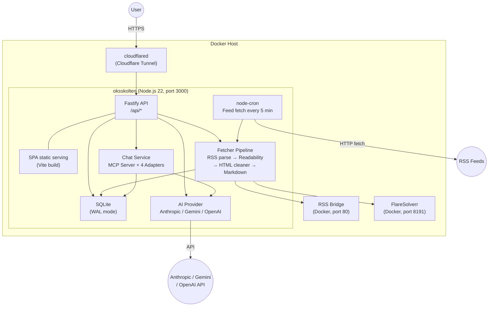

<p align="center">
  <picture>
    <source media="(prefers-color-scheme: dark)" srcset="https://assets.babarot.dev/files/2026/03/aeeb41766d888243.png">
    <source media="(prefers-color-scheme: light)" srcset="https://assets.babarot.dev/files/2026/03/c11e0ce04f0d06e6.png">
    
  </picture>
</p>
<!--
<p align="center">
  
</p>
-->

<p align="center">
  <a href="https://github.com/babarot/oksskolten/actions/workflows/test.yaml"></a>
  <a href="https://github.com/babarot/oksskolten/actions/workflows/test.yaml"></a>
  <a href="https://github.com/babarot/oksskolten/actions/workflows/test.yaml"></a>
</p>

<p align="center">
  <strong>Oksskolten</strong> <em>(pronounced "ooks-SKOL-ten")</em> — every article, full text, by default.
</p>

## Why Oksskolten?

Most RSS readers show what the feed gives you — a title and maybe a summary. Some (like Miniflux and FreshRSS) can fetch full article text, but it's opt-in per feed and requires configuration. Oksskolten does it for every article automatically: it fetches the original article, extracts the full text using Mozilla's Readability + 500 noise-removal patterns, converts it to clean Markdown, and stores it locally. No per-feed toggles, no manual CSS selectors — it just works.

Because Oksskolten always has the complete text, AI summarization and translation produce meaningful results, full-text search actually covers everything, and you never need to leave the app to read an article.

## See it in action

🕺 Live Demo → [demo.oksskolten.com](https://demo.oksskolten.com)

<p align="center">
  <picture>
    <source media="(prefers-color-scheme: dark)" srcset="docs/screenshots/home-default-dark.png">
    <source media="(prefers-color-scheme: light)" srcset="docs/screenshots/home-default-light.png">
    
  </picture>
  <picture>
    <source media="(prefers-color-scheme: dark)" srcset="docs/screenshots/inbox-default-dark.png">
    <source media="(prefers-color-scheme: light)" srcset="docs/screenshots/inbox-default-light.png">
    
  </picture>
  <picture>
    <source media="(prefers-color-scheme: dark)" srcset="docs/screenshots/article-chat-default-dark.png">
    <source media="(prefers-color-scheme: light)" srcset="docs/screenshots/article-chat-default-light.png">
    
  </picture>
  <picture>
    <source media="(prefers-color-scheme: dark)" srcset="docs/screenshots/appearance-default-dark.png">
    <source media="(prefers-color-scheme: light)" srcset="docs/screenshots/appearance-default-light.png">
    
  </picture>
</p>

## Features

- **Full-Text Extraction** — Every article is fetched from its source and processed through Readability + 500 noise-removal patterns. You read complete articles inside Oksskolten, never needing to click through to the original site
- **AI Summarization & Translation** — On-demand article processing via Anthropic, Gemini, or OpenAI with SSE streaming. Works on full article text, not RSS excerpts
- **Interactive Chat** — Multi-turn AI conversations with MCP tooling; search articles, get stats, and ask questions about your feeds
- **Full-Text Search** — Meilisearch-powered search across your entire article archive
- **Smart Fetching** — Adaptive per-feed scheduling, conditional HTTP requests (ETag/Last-Modified), content-hash deduplication, exponential backoff, and tracking parameter removal
- **PWA** — Offline reading, background sync, and add-to-home-screen support
- **Multi-Auth** — Password, Passkey (WebAuthn), and GitHub OAuth — each independently configurable
- **Smart Feed Management** — Auto-discovery, CSS selector-based feeds (via RSS Bridge), bot bypass (FlareSolverr), and automatic disabling of dead feeds
- **Article Clipping** — Save any URL as an article, with full content extraction
- **Theming** — 14 built-in color themes + custom theme import via JSON, 9 article fonts, 8 code highlighting styles
- **Single Container** — API, SPA, and cron scheduler all run in one Docker container

## Tech Stack

| Layer | Technology |
|---|---|
| Backend | [Node.js 22](https://nodejs.org/) + [Fastify](https://fastify.dev/) |
| Frontend | [React 19](https://react.dev/) + [Vite](https://vite.dev/) + [Tailwind CSS](https://tailwindcss.com/) + [shadcn/ui](https://ui.shadcn.com/) |
| Database | [SQLite](https://sqlite.org/) via [libsql](https://github.com/tursodatabase/libsql) (WAL mode) |
| AI | [Anthropic](https://docs.anthropic.com/) / [Gemini](https://ai.google.dev/) / [OpenAI](https://platform.openai.com/) |
| Search | [Meilisearch](https://www.meilisearch.com/) |
| Auth | JWT + [Passkey / WebAuthn](https://webauthn.io/) + GitHub OAuth |
| Deployment | Docker Compose + [Cloudflare Tunnel](https://developers.cloudflare.com/cloudflare-one/connections/connect-networks/) |

## Architecture



Everything runs in a single long-lived process — SQLite needs local disk, and node-cron needs a process that stays alive. This rules out serverless/edge runtimes but keeps the stack simple: one container, no external queues or coordination. For cloud deployment, a small VM or [Fly.io + Turso](docs/guides/deploying-to-fly-io.md) works well.

> **What's in a name?** Oksskolten is the highest peak in northern Norway — a mountain of knowledge for your feeds.

### Content Pipeline

Unlike traditional RSS readers that rely on feed-provided summaries, Oksskolten fetches every article directly from its source URL and extracts the full text. This means the reader is self-contained — no need to leave the app to read an article.

1. **Fetch RSS** — Adaptive per-feed scheduling with conditional requests (ETag/Last-Modified/content hash)
2. **Parse** — RSS/Atom/RDF parsed via feedsmith + fast-xml-parser, tracking parameters stripped
3. **Fetch Article** — Original article URL fetched directly (with FlareSolverr fallback for bot-protected sites)
4. **Extract** — Full article content extracted with Readability in isolated Worker Threads
5. **Clean** — ~500 noise-removal patterns strip ads, nav, sidebars, and tracking elements
6. **Convert** — HTML converted to Markdown with GFM support
7. **Enrich** — Language detection, OGP image extraction, excerpt generation
8. **Index** — Articles indexed in Meilisearch for full-text search

### Smart Fetching

The feed fetcher minimizes bandwidth and adapts to each feed's behavior, inspired by best practices from FreshRSS, Miniflux, and CommaFeed:

- **3-layer change detection** — HTTP 304 (ETag/Last-Modified) → content hash (SHA-256) → full parse. Unchanged feeds are caught early without parsing XML
- **Adaptive scheduling** — Each feed gets its own check interval (15min–4h) based on three signals: HTTP `Cache-Control`, RSS `<ttl>`, and actual article frequency. Active blogs are checked often; dormant ones back off automatically
- **Resilient error handling** — Exponential backoff on errors (1h–4h cap), but feeds are never disabled. Rate limits (429/503) respect `Retry-After` headers without counting as errors
- **URL deduplication** — 60+ tracking parameters (utm_*, fbclid, gclid, etc.) are stripped before duplicate checking, preventing the same article from being inserted twice

## Comparison

| | Oksskolten | [Miniflux](https://github.com/miniflux/v2) | [FreshRSS](https://github.com/FreshRSS/FreshRSS) | [Feedly](https://feedly.com/) |
|---|---|---|---|---|
| **Full-text extraction** | Every article, by default | Opt-in per feed | Opt-in per feed | Auto (best-effort) |
| **Extraction engine** | Readability.js + 500 patterns | Go Readability (~390 lines, ~60 rules) | Manual CSS selectors | Proprietary |
| **JS-rendered sites** | FlareSolverr | — | — | Enterprise only |
| **Sites without RSS** | Auto-discovery → RSS Bridge → LLM inference | — | — | Pro+ (25) / Enterprise (100) |
| **AI summarization** | Built-in (Anthropic/Gemini/OpenAI) | — | — | Pro+ only (Leo) |
| **AI translation** | Built-in (+ Google Translate, DeepL) | — | — | Enterprise only |
| **AI chat** | MCP-powered, searches archive | — | — | — |
| **Search** | Meilisearch (typo-tolerant) | PostgreSQL full-text | SQL LIKE | Pro+ (Power Search) |
| **Database** | SQLite (embedded, WAL) | PostgreSQL (external) | MySQL/PG/SQLite | SaaS |
| **Deployment** | Single container | Binary + PostgreSQL | PHP + web server + DB | SaaS |
| **Offline reading** | PWA with background sync | — | — | Mobile apps only |
| **Auth** | Password + Passkey/WebAuthn + GitHub OAuth | Password + API key | Password + API key | Google/Apple/social + SAML (Enterprise) |
| **Themes** | 14 + custom JSON import | Light/Dark | ~10 themes | — |
| **Language** | Node.js (TypeScript) | Go | PHP | — |
| **Price** | Free / OSS (AGPL-3.0) | Free / OSS (Apache-2.0) | Free / OSS (AGPL-3.0) | $12.99/mo (Pro+) |

Miniflux and FreshRSS are excellent, mature projects. Oksskolten's focus is different: full-text extraction and AI as first-class defaults, not optional add-ons.

## Development

```bash
docker compose up --build   # HMR enabled
# Frontend: http://localhost:5173
# Backend:  http://localhost:3000

npm test                    # Run all tests
npm run build               # Production build
```

On first startup with an empty database, sample feeds and articles are automatically loaded from the demo seed data (`src/lib/demo/seed/*.json`). This gives you a populated UI to work with immediately. The seed is idempotent — it only runs when no RSS feeds exist in the database. To start with an empty database instead, set `NO_SEED=1`.

See [`.env.example`](.env.example) for available environment variables. AI provider keys are configured through the Settings UI.

## Deployment

Runs anywhere Docker runs — a home NAS, a Raspberry Pi, or a cloud VM.

```bash
# Production with Cloudflare Tunnel
docker compose -f compose.yaml -f compose.prod.yaml up --build -d
```

The production compose file includes a `cloudflared` sidecar that exposes the app via Cloudflare Tunnel — no port forwarding or static IP required.

## License

[AGPL-3.0](LICENSE)
