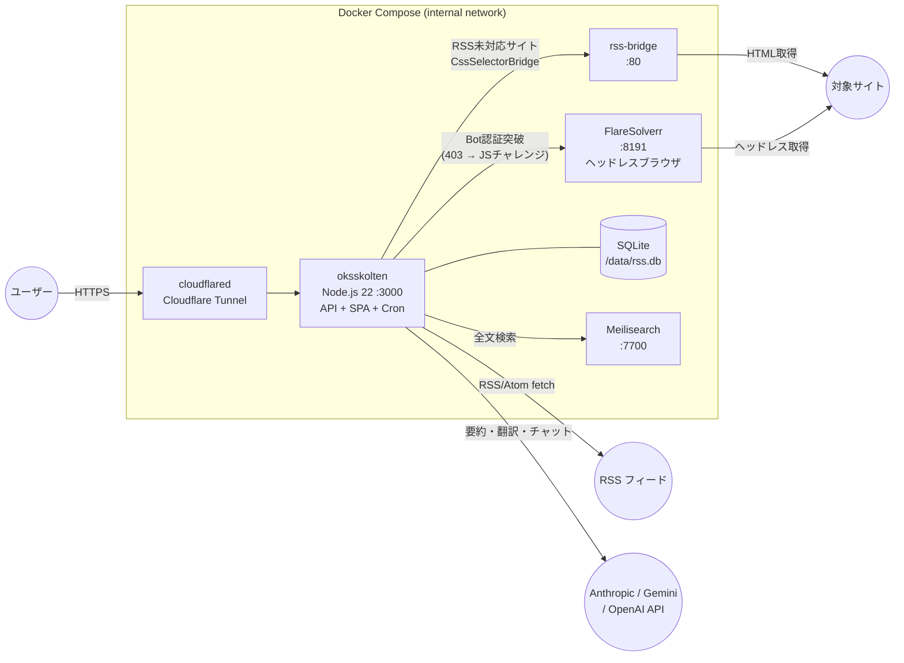

# Oksskolten 実装仕様書 — 概要

個人用RSSリーダー。単一Dockerコンテナで API・SPA配信・Cron を担う。NAS・VPS・クラウドVM など任意のDocker実行環境にデプロイ可能。

一般的な RSS リーダーはフィードが提供するタイトルと要約を表示するだけで、全文を読むには元サイトへ遷移する必要がある。Oksskolten は記事の元 URL から直接全文を取得し、Readability + 500 パターンのクリーナーで本文を抽出・保存する。記事の閲覧から AI 要約・翻訳・検索まで、すべてが Oksskolten 内で完結する。

> 本ドキュメントは仕様の概要部分。詳細は以下を参照:
>
> - [10_schema.md](./10_schema.ja.md) — SQLite スキーマ
> - [20_api.md](./20_api.ja.md) — API 仕様
> - [30_ingestion.md](./30_ingestion.ja.md) — 記事取得パイプライン・エラーハンドリング
> - [40_auth.md](./40_auth.ja.md) — 認証
> - [50_frontend.md](./50_frontend.ja.md) — フロントエンド（ルート・データフェッチ・PWA）
> - [80_feature_clip.md](./80_feature_clip.ja.md) — クリップ
> - [81_feature_images.md](./81_feature_images.ja.md) — 画像アーカイブ
> - [82_feature_chat.md](./82_feature_chat.ja.md) — チャット
> - [83_feature_similarity.md](./83_feature_similarity.ja.md) — 類似記事検出

## 技術スタック

| レイヤー | 技術 |
|---|---|
| ランタイム | Node.js 22 + Fastify（Docker） |
| DB | SQLite（libsql ドライバ）。ローカルファイル（WALモード）。Turso Cloud にも対応 |
| フロントエンド | React 19 + Vite + React Router + SWR + Framer Motion |
| スタイリング | Tailwind CSS（`darkMode: 'class'`） |
| PWA | vite-plugin-pwa（Workbox によるオフライン対応・キャッシュ戦略） |
| Markdown | marked.js（`{ gfm: true, breaks: true }`）+ DOMPurify（`ALLOWED_TAGS` はデフォルト、`<iframe>` は除外） |
| RSSパース | feedsmith（内部で fast-xml-parser を使用）。RSS 2.0 / Atom 1.0 / RSS 1.0 (RDF) に対応。feedsmith でパース不能な場合のみ fast-xml-parser で直接パースする |
| フルテキスト取得 | @mozilla/readability + jsdom + turndown + HTMLクリーナー（defuddleベース、ローカル処理）。piscina による Worker Thread で実行（メインスレッドのイベントループをブロックしない） |
| 言語判定 | ローカル処理（CJK文字比率による判定、API不要） |
| 要約 | Anthropic / Gemini / OpenAI から選択可能。デフォルト: Anthropic Haiku（`claude-haiku-4-5-20251001`）。オンデマンド・ストリーミング対応 |
| 翻訳 | Anthropic / Gemini / OpenAI / Google Translate / DeepL から選択可能。デフォルト: Anthropic Sonnet（`claude-sonnet-4-6`）。ja以外の記事のみ。オンデマンド・ストリーミング対応 |
| 認証 | JWT（`@fastify/jwt`）+ bcryptjs（パスワード認証）+ WebAuthn/Passkey（`@simplewebauthn/server`）+ GitHub OAuth（`arctic`） |
| レートリミット | `@fastify/rate-limit`（認証エンドポイントに適用） |
| デプロイ | `docker compose up -d`（NAS・VPS・クラウドVM等） |

## デプロイ構成

すべてのコンテナは `internal` ブリッジネットワークで接続。外部への公開ポートは持たず、`cloudflared` の Tunnel 経由でのみアクセス可能。

### 環境変数（.env）

本番では `TUNNEL_TOKEN` が必須。ローカル開発時はすべて省略可能（SQLite ローカルファイルで動作）。

| 変数 | 用途 | 必須 | 備考 |
|---|---|---|---|
| `DATABASE_URL` | DB接続先 | | 未設定時は `file:./data/rss.db`（ローカルファイル、WALモード）。`libsql://...` を指定すれば Turso Cloud にも対応 |
| `TURSO_AUTH_TOKEN` | Turso 認証トークン | | `DATABASE_URL` が `libsql://` の場合のみ必要 |
| `TUNNEL_TOKEN` | Cloudflare Tunnel トークン | 公開時: 必須 | cloudflared コンテナが使用 |
| `JWT_SECRET` | JWT 署名用シークレット | | 未設定時は初回起動時に自動生成しDBに永続化 |
| `PORT` | サーバーポート | | デフォルト `3000` |
| `RSS_BRIDGE_URL` | RSS Bridge の URL | | 例: `http://rss-bridge:80`。未設定時はBridge機能を無効化 |
| `FLARESOLVERR_URL` | FlareSolverr の URL | | 例: `http://flaresolverr:8191`。未設定時はBot認証突破機能を無効化 |
| `AUTH_DISABLED` | `1` で認証スキップ | | `NODE_ENV=development` 時のみ有効 |
| `FLARESOLVERR_CONCURRENCY` | FlareSolverr への同時リクエスト数 | | 未設定時は制限なし |
| `FETCH_CONCURRENCY` | 記事取得の同時接続数（セマフォ） | | デフォルト `5` |
| `PARSE_MAX_THREADS` | DOM解析の Worker Thread 数（piscina） | | デフォルト `2` |
| `CRON_SCHEDULE` | フィード取得の cron 式 | | デフォルト `*/5 * * * *`（5分毎） |
| `LOG_LEVEL` | Pino ログレベル | | デフォルト `info` |
| `MEILI_URL` | Meilisearch の URL | | デフォルト `http://localhost:7700` |
| `MEILI_MASTER_KEY` | Meilisearch マスターキー | | 未設定時はキーなしで接続 |
| `GIT_COMMIT` | ビルド時の Git コミット SHA | | `/api/health` で返却。未設定時 `'dev'` |
| `GIT_TAG` | ビルド時の Git タグ | | `/api/health` で返却。未設定時 `'dev'` |
| `BUILD_DATE` | ビルド日時（ISO 8601） | | `/api/health` で返却 |
| `TOOL_LOG_PATH` | Claude Code MCP ツールログ出力先 | | Claude Code アダプターが使用。未設定時はログなし |
| `VITE_DEMO_MODE` | `true` でデモモードビルド | | バックエンド不要の静的 SPA を生成 |
| `VITE_API_PROXY_TARGET` | Vite 開発時の API プロキシ先 | | デフォルト `http://127.0.0.1:3000` |
| `VITE_PORT` | Vite 開発サーバーポート | | デフォルト `5173` |

> **Note:** AI プロバイダーの API キー（Anthropic / Gemini / OpenAI / DeepL）と JWT シークレットは環境変数ではなく、DB の `settings` テーブルで管理する。API キーは設定画面（`/settings/ai`）の UI から設定可能。

### 主要コンポーネント

| コンポーネント | ファイル群 | 概要 |
|---|---|---|
| **Fetcher Pipeline** | `server/fetcher/` | RSSパース (2.0/Atom/RDF)、Readability 全文抽出、HTMLクリーナー (400+パターン)、Markdown変換、画像アーカイブ。DOM解析は piscina Worker Thread (max 2) で実行しイベントループを保護 |
| **AI Providers** | `server/providers/llm/` | 統一 `LLMProvider` インターフェース — Anthropic, Gemini, OpenAI, Claude Code |
| **Translation** | `server/providers/translate/` | Google Cloud Translation API v2 / DeepL（LLM翻訳の代替） |
| **Chat Service** | `server/chat/` | MCP サーバー + ツール定義、4バックエンドアダプター、会話永続化 |
| **HTML Cleaner** | `server/lib/cleaner/` | 3フェーズパイプライン: pre-clean → Readability → post-clean（セレクタベース、スコアリングベース、正規化） |
| **Auth** | `server/auth*.ts`, `server/passkey*.ts`, `server/oauth*.ts` | JWT + bcryptjs + WebAuthn/Passkey + GitHub OAuth |
| **RSS Bridge** | `server/rss-bridge.ts` | LLMが推定したCSSセレクタでRSSフィードのないサイトに対応 |
| **Frontend** | `src/` | React SPA — SWR データフェッチ、37+ コンポーネント、22+ フック、PWA（オフラインキュー付き） |

システム内部構造・データフロー・設計判断の詳細は [02_architecture.md](./02_architecture.ja.md) を参照。

