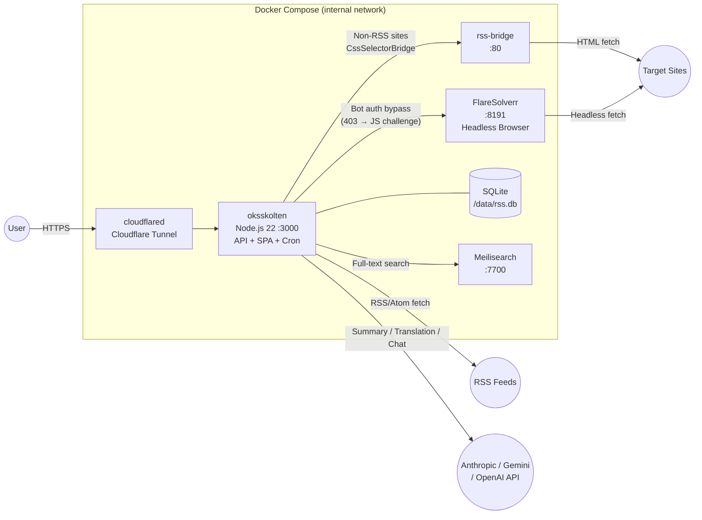

# Oksskolten Spec — Overview

A personal RSS reader. A single Docker container handles API, SPA serving, and cron jobs. Deployable on any Docker-capable environment — NAS, VPS, cloud VM, etc.

Typical RSS readers only display the title and summary provided by the feed, requiring users to visit the original site to read the full article. Oksskolten fetches full text directly from the article's source URL, extracting and storing the content using Readability + 500 cleaner patterns. Everything — from reading articles to AI summaries, translation, and search — is self-contained within Oksskolten.

> This document provides a spec overview. See the following for details:
>
> - [10_schema.md](./10_schema.md) — SQLite Schema
> - [20_api.md](./20_api.md) — API Spec
> - [30_ingestion.md](./30_ingestion.md) — Article Ingestion Pipeline & Error Handling
> - [40_auth.md](./40_auth.md) — Authentication
> - [50_frontend.md](./50_frontend.md) — Frontend (Routing, Data Fetching, PWA)
> - [80_feature_clip.md](./80_feature_clip.md) — Clip
> - [81_feature_images.md](./81_feature_images.md) — Image Archive
> - [82_feature_chat.md](./82_feature_chat.md) — Chat
> - [83_feature_similarity.md](./83_feature_similarity.md) — Similar Article Detection

## Tech Stack

| Layer | Technology |
|---|---|
| Runtime | Node.js 22 + Fastify (Docker) |
| DB | SQLite (libsql driver). Local file (WAL mode). Also supports Turso Cloud |
| Frontend | React 19 + Vite + React Router + SWR + Framer Motion |
| Styling | Tailwind CSS (`darkMode: 'class'`) |
| PWA | vite-plugin-pwa (offline support & caching via Workbox) |
| Markdown | marked.js (`{ gfm: true, breaks: true }`) + DOMPurify (default `ALLOWED_TAGS`, `<iframe>` excluded) |
| RSS Parsing | feedsmith (uses fast-xml-parser internally). Supports RSS 2.0 / Atom 1.0 / RSS 1.0 (RDF). Falls back to direct fast-xml-parser only when feedsmith fails |
| Full-text Extraction | @mozilla/readability + jsdom + turndown + HTML cleaner (defuddle-based, local processing). Runs in piscina Worker Threads (does not block the main event loop) |
| Language Detection | Local processing (CJK character ratio, no API needed) |
| Summarization | Selectable from Anthropic / Gemini / OpenAI. Default: Anthropic Haiku (`claude-haiku-4-5-20251001`). On-demand, streaming-capable |
| Translation | Selectable from Anthropic / Gemini / OpenAI / Google Translate / DeepL. Default: Anthropic Sonnet (`claude-sonnet-4-6`). Non-ja articles only. On-demand, streaming-capable |
| Authentication | JWT (`@fastify/jwt`) + bcryptjs (password auth) + WebAuthn/Passkey (`@simplewebauthn/server`) + GitHub OAuth (`arctic`) |
| Rate Limiting | `@fastify/rate-limit` (applied to auth endpoints) |
| Deployment | `docker compose up -d` (NAS, VPS, cloud VM, etc.) |

## Deployment Architecture

All containers are connected via an `internal` bridge network. No ports are exposed externally — access is only possible through the `cloudflared` Tunnel.

### Environment Variables (.env)

`TUNNEL_TOKEN` is required for production. All variables are optional for local development (runs with local SQLite file).

| Variable | Purpose | Required | Notes |
|---|---|---|---|
| `DATABASE_URL` | DB connection | | Defaults to `file:./data/rss.db` (local file, WAL mode). Supports Turso Cloud with `libsql://...` |
| `TURSO_AUTH_TOKEN` | Turso auth token | | Only needed when `DATABASE_URL` is `libsql://` |
| `TUNNEL_TOKEN` | Cloudflare Tunnel token | Production: Yes | Used by cloudflared container |
| `JWT_SECRET` | JWT signing secret | | Auto-generated on first startup and persisted in DB if not set |
| `PORT` | Server port | | Default `3000` |
| `RSS_BRIDGE_URL` | RSS Bridge URL | | e.g. `http://rss-bridge:80`. Bridge feature disabled if not set |
| `FLARESOLVERR_URL` | FlareSolverr URL | | e.g. `http://flaresolverr:8191`. Bot auth bypass disabled if not set |
| `AUTH_DISABLED` | `1` to skip auth | | Only effective when `NODE_ENV=development` |
| `FLARESOLVERR_CONCURRENCY` | Max concurrent FlareSolverr requests | | Unlimited if not set |
| `FETCH_CONCURRENCY` | Article fetch concurrency (semaphore) | | Default `5` |
| `PARSE_MAX_THREADS` | DOM parsing Worker Thread count (piscina) | | Default `2` |
| `CRON_SCHEDULE` | Feed fetch cron expression | | Default `*/5 * * * *` (every 5 min) |
| `LOG_LEVEL` | Pino log level | | Default `info` |
| `MEILI_URL` | Meilisearch URL | | Default `http://localhost:7700` |
| `MEILI_MASTER_KEY` | Meilisearch master key | | Connects without key if not set |
| `GIT_COMMIT` | Git commit SHA at build time | | Returned in `/api/health`. Defaults to `'dev'` |
| `GIT_TAG` | Git tag at build time | | Returned in `/api/health`. Defaults to `'dev'` |
| `BUILD_DATE` | Build date (ISO 8601) | | Returned in `/api/health` |
| `TOOL_LOG_PATH` | Claude Code MCP tool log output path | | Used by Claude Code adapter. No logging if not set |
| `VITE_DEMO_MODE` | `true` for demo mode build | | Generates a static SPA without backend |
| `VITE_API_PROXY_TARGET` | Vite dev API proxy target | | Default `http://127.0.0.1:3000` |
| `VITE_PORT` | Vite dev server port | | Default `5173` |

> **Note:** AI provider API keys (Anthropic / Gemini / OpenAI / DeepL) and JWT secret are managed in the DB `settings` table, not as environment variables. API keys can be configured via the settings UI (`/settings/ai`).

### Key Components

| Component | Files | Overview |
|---|---|---|
| **Fetcher Pipeline** | `server/fetcher/` | RSS parsing (2.0/Atom/RDF), Readability full-text extraction, HTML cleaner (400+ patterns), Markdown conversion, image archiving. DOM parsing runs in piscina Worker Threads (max 2) to protect the event loop |
| **AI Providers** | `server/providers/llm/` | Unified `LLMProvider` interface — Anthropic, Gemini, OpenAI, Claude Code |
| **Translation** | `server/providers/translate/` | Google Cloud Translation API v2 / DeepL (alternative to LLM translation) |
| **Chat Service** | `server/chat/` | MCP server + tool definitions, 4 backend adapters, conversation persistence |
| **HTML Cleaner** | `server/lib/cleaner/` | 3-phase pipeline: pre-clean → Readability → post-clean (selector-based, scoring-based, normalization) |
| **Auth** | `server/auth*.ts`, `server/passkey*.ts`, `server/oauth*.ts` | JWT + bcryptjs + WebAuthn/Passkey + GitHub OAuth |
| **RSS Bridge** | `server/rss-bridge.ts` | LLM-inferred CSS selectors for sites without RSS feeds |
| **Frontend** | `src/` | React SPA — SWR data fetching, 37+ components, 22+ hooks, PWA (with offline queue) |

For details on system internals, data flow, and design decisions, see [02_architecture.md](./02_architecture.md).
