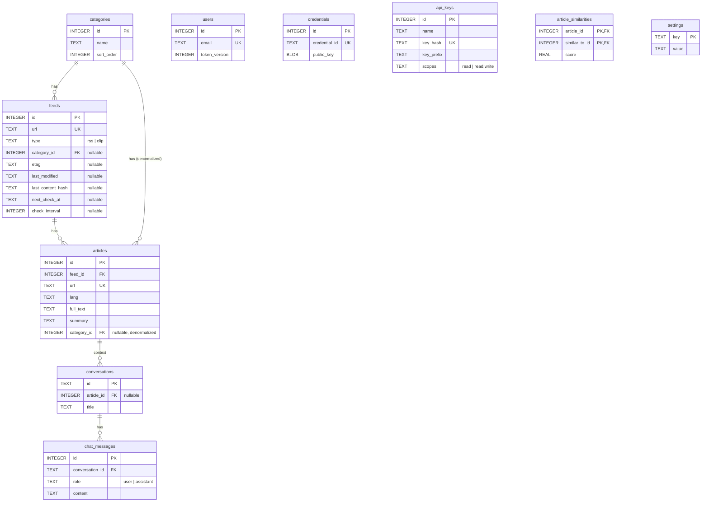

# Oksskolten 実装仕様書 — SQLite スキーマ

> [概要に戻る](./01_overview.ja.md)

## SQLite スキーマ

### テーブル関連図



- `feeds.category_id → categories.id`（ON DELETE SET NULL）
- `articles.feed_id → feeds.id`（ON DELETE CASCADE）
- `articles.category_id → categories.id`（ON DELETE SET NULL、フィードのカテゴリを非正規化）
- `conversations.article_id → articles.id`（ON DELETE SET NULL）
- `chat_messages.conversation_id → conversations.id`（ON DELETE CASCADE）
- `article_similarities.article_id → articles.id` および `article_similarities.similar_to_id → articles.id`（ON DELETE CASCADE）。双方向: `(A,B)` と `(B,A)` の両方を格納
- `users` / `credentials` / `settings` / `api_keys` は他テーブルへのFKなし

### テーブル定義

```sql
CREATE TABLE categories (
  id         INTEGER PRIMARY KEY AUTOINCREMENT,
  name       TEXT NOT NULL,
  sort_order INTEGER NOT NULL DEFAULT 0,
  collapsed  INTEGER NOT NULL DEFAULT 0,
  created_at TEXT NOT NULL DEFAULT (datetime('now'))
);

CREATE TABLE feeds (
  id              INTEGER PRIMARY KEY AUTOINCREMENT,
  name            TEXT NOT NULL,                      -- 表示用: "Cloudflare Blog"
  url             TEXT NOT NULL UNIQUE,               -- ブログのトップURL（clip: 'clip://saved'）
  rss_url         TEXT,                               -- 解決済みRSS URL
  rss_bridge_url  TEXT,                               -- RSSBridge経由の場合
  type            TEXT NOT NULL DEFAULT 'rss',        -- 'rss' | 'clip'
  category_id     INTEGER REFERENCES categories(id) ON DELETE SET NULL,
  last_error      TEXT,                               -- 最後のfetchエラー
  error_count     INTEGER NOT NULL DEFAULT 0,         -- 連続エラー回数
  disabled              INTEGER NOT NULL DEFAULT 0,   -- 1=自動無効化（連続5回失敗）
  requires_js_challenge INTEGER NOT NULL DEFAULT 0,   -- 1=Bot認証(JSチャレンジ)突破が必要なサイト
  etag                  TEXT,                         -- 前回レスポンスの ETag（条件付きリクエスト用）
  last_modified         TEXT,                         -- 前回レスポンスの Last-Modified（条件付きリクエスト用）
  last_content_hash     TEXT,                         -- 前回レスポンスボディの SHA-256（ETag非対応サーバー用）
  next_check_at         TEXT,                         -- 次回チェック予定時刻（ISO8601、NULL=即座にチェック）
  check_interval        INTEGER,                      -- 現在のチェック間隔（秒）。notModified時の再利用用
  created_at            TEXT NOT NULL DEFAULT (datetime('now'))
);

CREATE INDEX idx_feeds_category_id ON feeds(category_id);

CREATE TABLE articles (
  id              INTEGER PRIMARY KEY AUTOINCREMENT,
  feed_id         INTEGER NOT NULL REFERENCES feeds(id) ON DELETE CASCADE,
  title           TEXT NOT NULL,
  url             TEXT NOT NULL UNIQUE,
  published_at    TEXT,                               -- ISO 8601に正規化
  lang            TEXT,                               -- "en" / "ja" etc.
  full_text       TEXT,                               -- Readability取得のMarkdown原文
  full_text_ja    TEXT,                               -- 英語記事の日本語訳
  summary         TEXT,                               -- 日本語要約
  excerpt         TEXT,                               -- 200文字プレビュー（full_textから自動生成）
  og_image        TEXT,                               -- OGP画像URL
  last_error      TEXT,                               -- fetch/Claude APIエラー
  fetched_at      TEXT NOT NULL DEFAULT (datetime('now')),
  seen_at         TEXT,                               -- 認知日時（スクロール通過 or 記事を開く、初回のみ）
  read_at         TEXT,                               -- 実際に読んだ日時（記事を開くたびに上書き）
  bookmarked_at   TEXT,                               -- ブックマーク日時
  liked_at        TEXT,                               -- いいね日時
  images_archived_at TEXT,                            -- 画像アーカイブ完了日時
  score           REAL NOT NULL DEFAULT 0,             -- エンゲージメント×時間減衰スコア（Cron定期更新+アクション時即時更新）
  category_id     INTEGER REFERENCES categories(id) ON DELETE SET NULL, -- フィードのカテゴリを非正規化して保持（カテゴリ別ソート高速化用）
  created_at      TEXT NOT NULL DEFAULT (datetime('now'))
);

CREATE INDEX idx_articles_feed_id ON articles(feed_id);
CREATE INDEX idx_articles_published_at ON articles(published_at DESC);
CREATE INDEX idx_articles_bookmarked_at ON articles(bookmarked_at);
CREATE INDEX idx_articles_feed_seen_at ON articles(feed_id, seen_at);
CREATE INDEX idx_articles_seen_at ON articles(seen_at);
CREATE INDEX idx_articles_read_at ON articles(read_at);
CREATE INDEX idx_articles_score ON articles(score DESC);
CREATE INDEX idx_articles_liked_at ON articles(liked_at);
CREATE INDEX idx_articles_category_published ON articles(category_id, published_at DESC);
CREATE INDEX idx_articles_feed_score ON articles(feed_id, score DESC);
CREATE INDEX idx_articles_category_score ON articles(category_id, score DESC);

CREATE TABLE settings (
  key   TEXT PRIMARY KEY,
  value TEXT NOT NULL
);

CREATE TABLE users (
  id            INTEGER PRIMARY KEY AUTOINCREMENT,
  email         TEXT NOT NULL UNIQUE,
  password_hash TEXT NOT NULL,
  token_version INTEGER NOT NULL DEFAULT 0,          -- パスワード変更時にインクリメント→JWT無効化
  created_at    TEXT NOT NULL DEFAULT (datetime('now')),
  updated_at    TEXT NOT NULL DEFAULT (datetime('now'))
);

CREATE TABLE credentials (
  id              INTEGER PRIMARY KEY AUTOINCREMENT,
  credential_id   TEXT NOT NULL UNIQUE,              -- WebAuthn credential ID
  public_key      BLOB NOT NULL,                     -- WebAuthn public key
  counter         INTEGER NOT NULL DEFAULT 0,        -- 署名カウンター
  device_type     TEXT NOT NULL,                     -- "singleDevice" / "multiDevice"
  backed_up       INTEGER NOT NULL DEFAULT 0,        -- 同期済みかどうか
  transports      TEXT,                              -- JSON配列（"usb", "ble", "nfc", "internal"）
  aaguid          TEXT,                              -- 認証器識別子（AAGUID→名前ルックアップ用）
  created_at      TEXT DEFAULT (datetime('now'))
);

CREATE TABLE conversations (
  id            TEXT PRIMARY KEY,
  title         TEXT,
  article_id    INTEGER REFERENCES articles(id) ON DELETE SET NULL,
  created_at    TEXT NOT NULL DEFAULT (datetime('now')),
  updated_at    TEXT NOT NULL DEFAULT (datetime('now'))
);

CREATE TABLE chat_messages (
  id              INTEGER PRIMARY KEY AUTOINCREMENT,
  conversation_id TEXT NOT NULL REFERENCES conversations(id) ON DELETE CASCADE,
  role            TEXT NOT NULL CHECK (role IN ('user', 'assistant')),
  content         TEXT NOT NULL,   -- JSON: Anthropic messages 形式をそのまま保存
  created_at      TEXT NOT NULL DEFAULT (datetime('now'))
);

CREATE INDEX idx_chat_messages_conversation ON chat_messages(conversation_id, id);

CREATE TABLE api_keys (
  id           INTEGER PRIMARY KEY AUTOINCREMENT,
  name         TEXT    NOT NULL,                    -- 表示名: "監視スクリプト"
  key_hash     TEXT    NOT NULL UNIQUE,             -- フルキーのSHA-256ハッシュ（平文は保存しない）
  key_prefix   TEXT    NOT NULL,                    -- 表示用の先頭11文字: "ok_a1b2c3d4"
  scopes       TEXT    NOT NULL DEFAULT 'read',     -- 'read' | 'read,write'
  last_used_at TEXT,                                -- 検証成功ごとに更新
  created_at   TEXT    NOT NULL DEFAULT (datetime('now'))
);

CREATE TABLE article_similarities (
  article_id    INTEGER NOT NULL REFERENCES articles(id) ON DELETE CASCADE,
  similar_to_id INTEGER NOT NULL REFERENCES articles(id) ON DELETE CASCADE,
  score         REAL NOT NULL DEFAULT 0,            -- Bigram Dice係数（0.0〜1.0）
  created_at    TEXT NOT NULL DEFAULT (datetime('now')),
  PRIMARY KEY (article_id, similar_to_id)
);

CREATE INDEX idx_similarities_similar_to ON article_similarities(similar_to_id);
```

- フィード削除時、紐づく記事は `ON DELETE CASCADE` で自動削除される
- カテゴリ削除時、紐づくフィードの `category_id` は `ON DELETE SET NULL` で NULL に更新される
- 記事の識別は `articles.url`（UNIQUE）で行う。フィードの識別は `feeds.id`（INTEGER PK）で行う
- `settings` テーブルはkey-valueストアとして、ユーザー設定や認証設定を保存する
- `requires_js_challenge = 1` のフィードは、RSS取得・記事本文取得の全HTTPリクエストをFlareSolverr経由で実行する。フィード登録時にBot認証（Cloudflare等の403）が検出された場合に自動セットされる
- `etag` / `last_modified` / `last_content_hash` は帯域最適化のためのキャッシュメタデータ。条件付きHTTPリクエスト（304応答）とコンテンツハッシュ比較により、未変更フィードのXMLパースをスキップする
- `next_check_at` / `check_interval` は適応型リフレッシュ間隔のスケジューリング用。HTTP `Cache-Control` / `Expires`、RSS `<ttl>`、記事更新頻度の3シグナルから最大値を採用し、15分〜4時間の範囲でクランプする。notModified 時は `check_interval` に保存された前回の間隔を再利用する。日時フォーマットは `strftime('%Y-%m-%dT%H:%M:%SZ')` 互換（ミリ秒なし）
- `feeds.type = 'clip'` はクリップ専用フィード（シングルトン）。Cron取得対象外。詳細は [80_feature_clip.md](./80_feature_clip.ja.md) 参照
- 会話削除時、紐づくメッセージは `ON DELETE CASCADE` で自動削除される。記事削除時、紐づく会話の `article_id` は `ON DELETE SET NULL` で NULL に更新される

### 計算フィールド（FeedWithCounts）

`GET /api/feeds` が返す各フィードには、以下のサブクエリ計算フィールドが含まれる:

| フィールド | 型 | 計算方法 |
|---|---|---|
| `article_count` | number | `COUNT(*)` |
| `unread_count` | number | `SUM(CASE WHEN seen_at IS NULL THEN 1 ELSE 0 END)` |
| `articles_per_week` | number | 直近28日の記事数 / 4.0（`COALESCE(published_at, fetched_at)` 基準） |
| `latest_published_at` | string \| null | `MAX(COALESCE(published_at, fetched_at))` |

- `published_at` が null の記事（RSS Bridge 経由等）は `fetched_at` をフォールバックとして使用
- 日付比較は `strftime('%Y-%m-%dT%H:%M:%SZ', 'now', '-28 days')` で ISO8601 形式に揃えて行う
- `is_inactive` の判定はアプリ層で行う: `latest_published_at` が90日以上前、または記事ありで `latest_published_at` が null
- 記事検索は `LIKE '%keyword%'` による部分一致検索で行う（FTS5 仮想テーブルは使用しない）

### エンゲージメントスコア

`articles.score` は **エンゲージメント × 時間減衰** の積で計算される。Cron 実行ごとに全記事を再計算し、like/bookmark 等のアクション時にも即時更新する。

```
score = engagement × decay

engagement = (liked_at ? 10 : 0)
           + (bookmarked_at ? 5 : 0)
           + (full_text_ja ? 3 : 0)    -- 翻訳済み
           + (read_at ? 2 : 0)

decay = 1.0 / (1.0 + days_since_activity × 0.05)
  where days_since_activity = julianday('now') - julianday(COALESCE(read_at, published_at, fetched_at))
```

- `decay` は最近アクションした記事ほど高い値（最大1.0）を取り、古い記事は徐々に減衰する
- 検索結果のソート時は `score × 5.0` のブースト係数が掛かる（`SEARCH_BOOST_FACTOR`）
