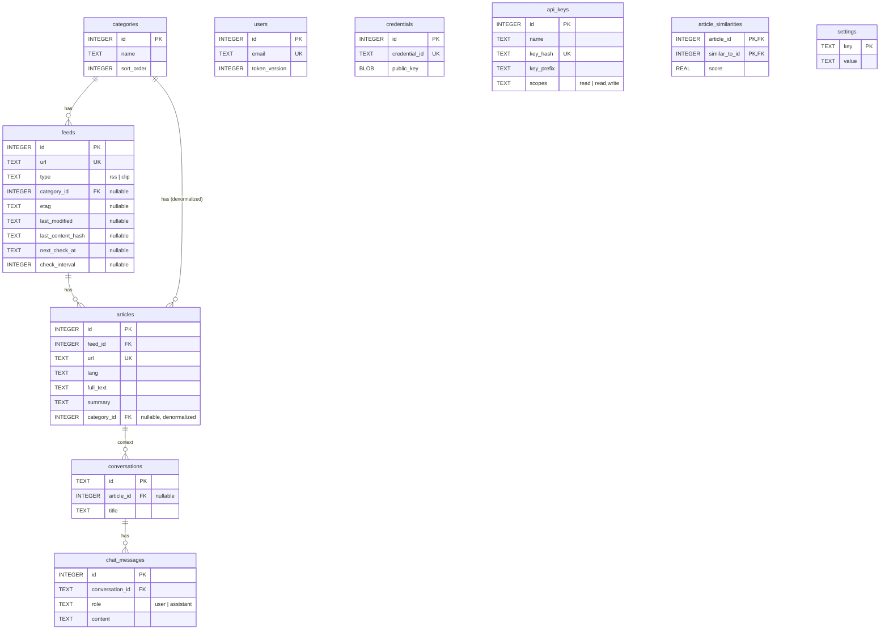

# Oksskolten Spec — SQLite Schema

> [Back to Overview](./01_overview.md)

## SQLite Schema

### Table Relationship Diagram



- `feeds.category_id → categories.id` (ON DELETE SET NULL)
- `articles.feed_id → feeds.id` (ON DELETE CASCADE)
- `articles.category_id → categories.id` (ON DELETE SET NULL; denormalized from feed's category)
- `conversations.article_id → articles.id` (ON DELETE SET NULL)
- `chat_messages.conversation_id → conversations.id` (ON DELETE CASCADE)
- `article_similarities.article_id → articles.id` and `article_similarities.similar_to_id → articles.id` (ON DELETE CASCADE). Bidirectional: both `(A,B)` and `(B,A)` are stored
- `users` / `credentials` / `settings` / `api_keys` have no foreign keys to other tables

### Table Definitions

```sql
CREATE TABLE categories (
  id         INTEGER PRIMARY KEY AUTOINCREMENT,
  name       TEXT NOT NULL,
  sort_order INTEGER NOT NULL DEFAULT 0,
  collapsed  INTEGER NOT NULL DEFAULT 0,
  created_at TEXT NOT NULL DEFAULT (datetime('now'))
);

CREATE TABLE feeds (
  id              INTEGER PRIMARY KEY AUTOINCREMENT,
  name            TEXT NOT NULL,                      -- Display name: "Cloudflare Blog"
  url             TEXT NOT NULL UNIQUE,               -- Blog top URL (clip: 'clip://saved')
  rss_url         TEXT,                               -- Resolved RSS URL
  rss_bridge_url  TEXT,                               -- URL when fetched via RSSBridge
  type            TEXT NOT NULL DEFAULT 'rss',        -- 'rss' | 'clip'
  category_id     INTEGER REFERENCES categories(id) ON DELETE SET NULL,
  last_error      TEXT,                               -- Last fetch error
  error_count     INTEGER NOT NULL DEFAULT 0,         -- Consecutive error count
  disabled              INTEGER NOT NULL DEFAULT 0,   -- 1=auto-disabled (5 consecutive failures)
  requires_js_challenge INTEGER NOT NULL DEFAULT 0,   -- 1=site requires bot verification (JS challenge) bypass
  etag                  TEXT,                         -- Previous response ETag (for conditional requests)
  last_modified         TEXT,                         -- Previous response Last-Modified (for conditional requests)
  last_content_hash     TEXT,                         -- SHA-256 of previous response body (for servers without ETag)
  next_check_at         TEXT,                         -- Next scheduled check time (ISO8601, NULL=check immediately)
  check_interval        INTEGER,                      -- Current check interval (seconds); reused on notModified
  created_at            TEXT NOT NULL DEFAULT (datetime('now'))
);

CREATE INDEX idx_feeds_category_id ON feeds(category_id);

CREATE TABLE articles (
  id              INTEGER PRIMARY KEY AUTOINCREMENT,
  feed_id         INTEGER NOT NULL REFERENCES feeds(id) ON DELETE CASCADE,
  title           TEXT NOT NULL,
  url             TEXT NOT NULL UNIQUE,
  published_at    TEXT,                               -- Normalized to ISO 8601
  lang            TEXT,                               -- "en" / "ja" etc.
  full_text       TEXT,                               -- Original Markdown from Readability
  full_text_ja    TEXT,                               -- Japanese translation of English articles
  summary         TEXT,                               -- Japanese summary
  excerpt         TEXT,                               -- 200-char preview (auto-generated from full_text)
  og_image        TEXT,                               -- OGP image URL
  last_error      TEXT,                               -- Fetch / Claude API error
  fetched_at      TEXT NOT NULL DEFAULT (datetime('now')),
  seen_at         TEXT,                               -- Awareness timestamp (scroll-past or article open, first time only)
  read_at         TEXT,                               -- Actual read timestamp (overwritten each time the article is opened)
  bookmarked_at   TEXT,                               -- Bookmark timestamp
  liked_at        TEXT,                               -- Like timestamp
  images_archived_at TEXT,                            -- Image archive completion timestamp
  score           REAL NOT NULL DEFAULT 0,             -- Engagement × time-decay score (periodic Cron update + immediate update on action)
  category_id     INTEGER REFERENCES categories(id) ON DELETE SET NULL, -- Denormalized feed category (for fast category-based sorting)
  created_at      TEXT NOT NULL DEFAULT (datetime('now'))
);

CREATE INDEX idx_articles_feed_id ON articles(feed_id);
CREATE INDEX idx_articles_published_at ON articles(published_at DESC);
CREATE INDEX idx_articles_bookmarked_at ON articles(bookmarked_at);
CREATE INDEX idx_articles_feed_seen_at ON articles(feed_id, seen_at);
CREATE INDEX idx_articles_seen_at ON articles(seen_at);
CREATE INDEX idx_articles_read_at ON articles(read_at);
CREATE INDEX idx_articles_score ON articles(score DESC);
CREATE INDEX idx_articles_liked_at ON articles(liked_at);
CREATE INDEX idx_articles_category_published ON articles(category_id, published_at DESC);
CREATE INDEX idx_articles_feed_score ON articles(feed_id, score DESC);
CREATE INDEX idx_articles_category_score ON articles(category_id, score DESC);

CREATE TABLE settings (
  key   TEXT PRIMARY KEY,
  value TEXT NOT NULL
);

CREATE TABLE users (
  id            INTEGER PRIMARY KEY AUTOINCREMENT,
  email         TEXT NOT NULL UNIQUE,
  password_hash TEXT NOT NULL,
  token_version INTEGER NOT NULL DEFAULT 0,          -- Incremented on password change → invalidates JWTs
  created_at    TEXT NOT NULL DEFAULT (datetime('now')),
  updated_at    TEXT NOT NULL DEFAULT (datetime('now'))
);

CREATE TABLE credentials (
  id              INTEGER PRIMARY KEY AUTOINCREMENT,
  credential_id   TEXT NOT NULL UNIQUE,              -- WebAuthn credential ID
  public_key      BLOB NOT NULL,                     -- WebAuthn public key
  counter         INTEGER NOT NULL DEFAULT 0,        -- Signature counter
  device_type     TEXT NOT NULL,                     -- "singleDevice" / "multiDevice"
  backed_up       INTEGER NOT NULL DEFAULT 0,        -- Whether synced
  transports      TEXT,                              -- JSON array ("usb", "ble", "nfc", "internal")
  aaguid          TEXT,                              -- Authenticator identifier (for AAGUID → name lookup)
  created_at      TEXT DEFAULT (datetime('now'))
);

CREATE TABLE conversations (
  id            TEXT PRIMARY KEY,
  title         TEXT,
  article_id    INTEGER REFERENCES articles(id) ON DELETE SET NULL,
  created_at    TEXT NOT NULL DEFAULT (datetime('now')),
  updated_at    TEXT NOT NULL DEFAULT (datetime('now'))
);

CREATE TABLE chat_messages (
  id              INTEGER PRIMARY KEY AUTOINCREMENT,
  conversation_id TEXT NOT NULL REFERENCES conversations(id) ON DELETE CASCADE,
  role            TEXT NOT NULL CHECK (role IN ('user', 'assistant')),
  content         TEXT NOT NULL,   -- JSON: stored as-is in Anthropic messages format
  created_at      TEXT NOT NULL DEFAULT (datetime('now'))
);

CREATE INDEX idx_chat_messages_conversation ON chat_messages(conversation_id, id);

CREATE TABLE api_keys (
  id           INTEGER PRIMARY KEY AUTOINCREMENT,
  name         TEXT    NOT NULL,                    -- Display name: "Monitoring script"
  key_hash     TEXT    NOT NULL UNIQUE,             -- SHA-256 hash of the full key (plaintext is never stored)
  key_prefix   TEXT    NOT NULL,                    -- First 11 chars for display: "ok_a1b2c3d4"
  scopes       TEXT    NOT NULL DEFAULT 'read',     -- 'read' | 'read,write'
  last_used_at TEXT,                                -- Updated on each successful validation
  created_at   TEXT    NOT NULL DEFAULT (datetime('now'))
);

CREATE TABLE article_similarities (
  article_id    INTEGER NOT NULL REFERENCES articles(id) ON DELETE CASCADE,
  similar_to_id INTEGER NOT NULL REFERENCES articles(id) ON DELETE CASCADE,
  score         REAL NOT NULL DEFAULT 0,            -- Bigram Dice coefficient (0.0–1.0)
  created_at    TEXT NOT NULL DEFAULT (datetime('now')),
  PRIMARY KEY (article_id, similar_to_id)
);

CREATE INDEX idx_similarities_similar_to ON article_similarities(similar_to_id);
```

- When a feed is deleted, its associated articles are automatically removed via `ON DELETE CASCADE`
- When a category is deleted, the `category_id` of associated feeds is set to NULL via `ON DELETE SET NULL`
- Articles are identified by `articles.url` (UNIQUE). Feeds are identified by `feeds.id` (INTEGER PK)
- The `settings` table is a key-value store for user preferences and authentication configuration
- Feeds with `requires_js_challenge = 1` route all HTTP requests (RSS fetch and article body fetch) through FlareSolverr. This flag is automatically set when bot verification (e.g., Cloudflare 403) is detected during feed registration
- `etag` / `last_modified` / `last_content_hash` are cache metadata for bandwidth optimization. Conditional HTTP requests (304 responses) and content hash comparison allow skipping XML parsing for unchanged feeds
- `next_check_at` / `check_interval` are used for adaptive refresh interval scheduling. The maximum value is chosen from three signals: HTTP `Cache-Control` / `Expires`, RSS `<ttl>`, and article update frequency, then clamped to the range of 15 minutes to 4 hours. On notModified, the previous interval stored in `check_interval` is reused. The datetime format is compatible with `strftime('%Y-%m-%dT%H:%M:%SZ')` (no milliseconds)
- `feeds.type = 'clip'` denotes the clip-only feed (singleton). It is excluded from Cron fetching. See [80_feature_clip.md](./80_feature_clip.md) for details
- When a conversation is deleted, its associated messages are automatically removed via `ON DELETE CASCADE`. When an article is deleted, the `article_id` of associated conversations is set to NULL via `ON DELETE SET NULL`

### Computed Fields (FeedWithCounts)

Each feed returned by `GET /api/feeds` includes the following subquery-computed fields:

| Field | Type | Computation |
|---|---|---|
| `article_count` | number | `COUNT(*)` |
| `unread_count` | number | `SUM(CASE WHEN seen_at IS NULL THEN 1 ELSE 0 END)` |
| `articles_per_week` | number | Article count over the last 28 days / 4.0 (based on `COALESCE(published_at, fetched_at)`) |
| `latest_published_at` | string \| null | `MAX(COALESCE(published_at, fetched_at))` |

- Articles where `published_at` is null (e.g., via RSS Bridge) use `fetched_at` as a fallback
- Date comparisons use `strftime('%Y-%m-%dT%H:%M:%SZ', 'now', '-28 days')` to align on ISO8601 format
- `is_inactive` is determined at the application layer: `latest_published_at` is more than 90 days ago, or the feed has articles but `latest_published_at` is null
- Article search uses `LIKE '%keyword%'` partial matching (FTS5 virtual tables are not used)

### Engagement Score

`articles.score` is computed as the product of **engagement x time decay**. It is recalculated for all articles on each Cron run and also updated immediately on actions such as like/bookmark.

```
score = engagement × decay

engagement = (liked_at ? 10 : 0)
           + (bookmarked_at ? 5 : 0)
           + (full_text_ja ? 3 : 0)    -- translated
           + (read_at ? 2 : 0)

decay = 1.0 / (1.0 + days_since_activity × 0.05)
  where days_since_activity = julianday('now') - julianday(COALESCE(read_at, published_at, fetched_at))
```

- `decay` yields a higher value (maximum 1.0) for recently acted-upon articles, gradually diminishing for older ones
- When sorting search results, a boost factor of `score × 5.0` is applied (`SEARCH_BOOST_FACTOR`)
