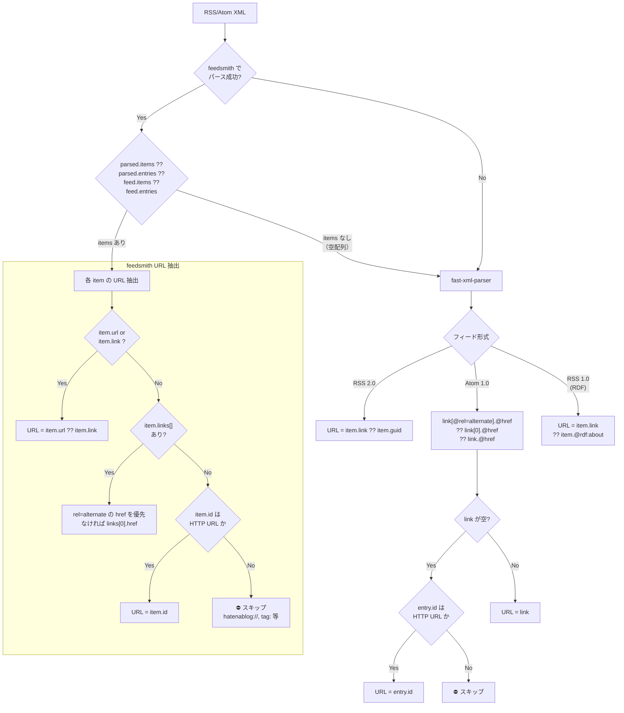
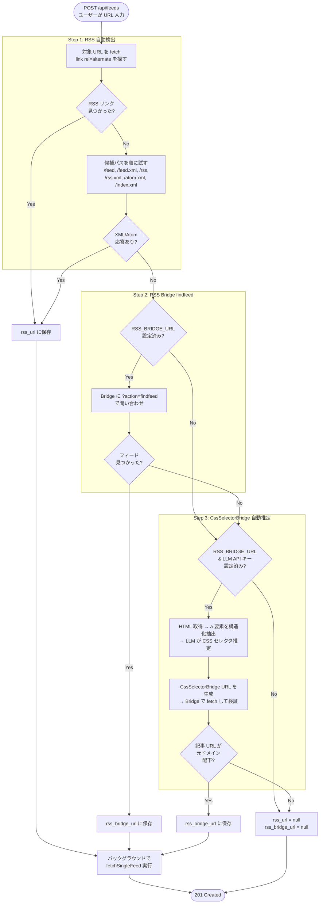
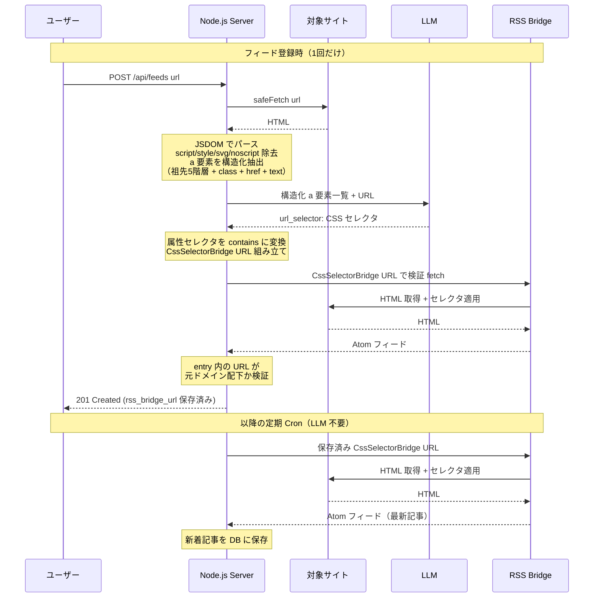

# Oksskolten 実装仕様書 — 記事取得パイプライン

> [概要に戻る](./01_overview.ja.md)

## 記事取得パイプライン

### 設計思想: RSS フィードを超えた全文取得

一般的な RSS リーダー（FreshRSS, CommaFeed 等）は RSS フィードの XML に含まれるコンテンツ（`content:encoded`, `description`）をそのまま表示する。多くのフィードはタイトルと数行の要約しか提供しないため、全文を読むには元サイトへ遷移する必要がある。

Oksskolten は**すべての記事について元 URL から直接 HTML を取得**し、Readability で全文を抽出する。これにより:

- **アプリ内で完結**: 記事の閲覧に元サイトへの遷移が不要
- **AI 処理の品質向上**: 要約・翻訳が RSS の断片ではなく完全な本文に基づく
- **全文検索の精度向上**: Meilisearch のインデックスに完全な本文が入る

> Miniflux のみオプションで Readability ベースの Crawler 機能を持つが、フィードごとに手動で有効化が必要。Oksskolten は全記事に対してデフォルトで全文取得を行う。

### Cron 処理フロー

Cron は 5 分間隔 (`*/5 * * * *`) で起動し、`next_check_at` が過ぎたフィードのみ処理する。

```
1. SELECT * FROM feeds WHERE disabled = 0 AND type = 'rss'
     AND (next_check_at IS NULL OR next_check_at <= strftime('%Y-%m-%dT%H:%M:%SZ', 'now'))
   ← next_check_at = NULL（初回/未設定）のフィードは即座にフェッチ
2. 各フィードのRSS URLをfetch（セマフォ同時5件で並列）
   - rss_url を優先して使用
   - rss_url が NULL の場合のみ rss_bridge_url を使用
   - どちらも NULL ならスキップ（last_error に "No RSS URL" を記録）
   ── 帯域最適化（2段階の早期リターン） ──
   2a. 条件付きHTTPリクエスト（第1防衛線）:
       - feeds.etag → If-None-Match、feeds.last_modified → If-Modified-Since ヘッダーを送信
       - サーバーが 304 Not Modified を返した場合、XMLダウンロード自体をスキップ
   2b. コンテンツハッシュ比較（第2防衛線、ETag非対応サーバー用）:
       - レスポンスボディの SHA-256 を計算し、feeds.last_content_hash と比較
       - 一致した場合、XMLパースをスキップ（notModified として早期リターン）
   2c. 成功時に feeds.etag / feeds.last_modified / feeds.last_content_hash を更新
   ── 適応型スケジューリング ──
   2e. 3 シグナルから次回チェック間隔を決定:
       - HTTP Cache-Control: max-age / Expires ヘッダー
       - RSS <ttl> 要素（分単位→秒変換）
       - Empirical（CommaFeed方式: 記事更新頻度ベースのステップダウン）
         30日以上更新なし → 4h / 14-30日 → 2h / 7-14日 → 1h / 7日未満 → 平均記事間隔の半分
       - 3 シグナルの最大値を採用し、15分〜4時間にクランプ
       - feeds.next_check_at = now + interval、feeds.check_interval = interval を保存
       - notModified 時は前回の check_interval を再利用（間隔が短縮されない）
   ── パース ──
   2d. feedsmith → fast-xml-parser のフォールバックチェーンでRSS/Atomをパース
       （RSS 2.0 / Atom 1.0 / RSS 1.0 (RDF) 対応）
       パース・URL抽出の詳細は下記「RSSパース・URL抽出フロー」を参照
   2f. URLトラッキングパラメータ除去（Miniflux方式）
       - パース後、重複チェック前に全記事URLから60+のトラッキングパラメータを除去
       - 対象: utm_*, mtm_*, fbclid, gclid, msclkid, twclid, mc_cid, _hsenc 等
       - 同一記事が異なるトラッキングパラメータ付きで配信された場合の重複挿入を防止
3. 各記事URLをSELECT → articlesにないものを新着リストに追加（フィードあたり最大30件）
4. リトライ対象の既存記事を取得:
   SELECT * FROM articles
   WHERE last_error IS NOT NULL
     AND (full_text IS NULL OR summary IS NULL
          OR (lang != 'ja' AND full_text_ja IS NULL))
5. 新着 + リトライ対象をセマフォ（同時5件）で並列処理:
   a. full_text が NULL → HTMLクリーニング+Readability+Turndownでフルテキスト取得
      - pre-clean → Readability → post-clean → Markdown変換（詳細は後述のパイプライン参照）
      - OGP画像（og_image）を抽出
      - 200文字プレビュー（excerpt）を生成
   b. lang が NULL → ローカルでCJK文字比率から言語判定（API不要）
   c. 新着: INSERT INTO articles / リトライ: UPDATE articles
   d. 新着記事: 非同期で類似記事検出を実行（fire-and-forget、詳細は [83_feature_similarity.ja.md](./83_feature_similarity.ja.md) 参照）
   e. 処理成功時: last_error = NULL にクリア
6. フィード単位: fetch成功時 error_count=0, last_error=NULL にリセット
7. フィード単位: fetch失敗時 error_count++, last_error に記録
8. error_count >= 5 のフィードは disabled = 1 に更新
9. 残りは次回Cronで継続
```

### RSSパース・URL抽出フロー

feedsmith → fast-xml-parser のフォールバックチェーンと、各アイテムからURL を安全に抽出するフロー。Atom `<id>` に `hatenablog://` や `tag:` 等の内部URIが入るケースをフィルタする。



**注意**: 要約（Haiku）と翻訳（Sonnet）はCronでは実行しない。ユーザーが記事を開いたときにオンデマンドで呼び出される（`POST /api/articles/:id/summarize`, `POST /api/articles/:id/translate`）。

### 共通記事フェッチ関数（`fetchArticleContent`）

フェッチ＋フォールバック＋言語判定ロジックは `server/fetcher.ts` の `fetchArticleContent()` 関数に集約されている。Cron パイプライン（`processArticle`）とクリップ保存エンドポイント（`POST /api/articles/from-url`）の両方がこの関数を呼び出し、フルテキスト取得・FlareSolverr フォールバック・bot block 検出・言語判定の挙動を統一している。RSS とクリップで渡すオプションの差異については[クリップ仕様](./80_feature_clip.ja.md#rssフィードとの共通フェッチパイプライン)を参照。

### フルテキスト取得・マークダウン変換パイプライン

記事URLからMarkdownテキストを生成するまでの全体フロー。HTMLクリーニング（defuddleベース）と Readability を組み合わせた多段パイプラインで、広告・ナビ・トラッキング属性等のノイズを除去した上でMarkdown変換する。外部APIへの依存はなくローカルで完結する。

**Worker Thread 分離**: DOM解析（jsdom + Readability + Turndown）はCPU集約的な同期処理であり、メインスレッドのイベントループをブロックする。これを防ぐため、piscina による Worker Thread プール（maxThreads: 2）で実行する。HTTP取得（非同期I/O）はメインスレッドに残し、DOM解析だけをWorkerに委譲する構成。

```
メインスレッド (イベントループ)          Worker Thread (piscina, max 2)
├─ Fastify API ← 影響なし             ├─ jsdom DOM構築
├─ cron → fetchAllFeeds               ├─ Readability 記事抽出
│   ├─ HTTP fetch (async I/O)         ├─ preClean / postClean
│   └─ pool.run(html) ──────────→     └─ Turndown → Markdown
└─ health check ← 影響なし
```

**実装ファイル**: `server/fetcher/content.ts`（HTTP取得 + プール呼び出し）, `server/fetcher/contentWorker.ts`（DOM解析ロジック）, `server/lib/cleaner/`

```
fetchFullText(articleUrl, cleanerConfig?)
│
├─ 1. HTML取得 + OGP画像抽出 [メインスレッド]
│     requires_js_challenge=1 → FlareSolverr経由で取得
│     それ以外 → safeFetch(url)、403時はFlareSolverrにフォールバック
│
├─ 2–6. pool.run() で Worker Thread に委譲 [Worker Thread]
│
├─ 2. Phase 1: pre-clean（Readability前の安全な除去）
│     preClean(doc, cleanerConfig)
│     ├─ script, style, noscript, [hidden], [aria-hidden="true"] 等を除去
│     └─ ~20個の安全なCSSセレクタで確実にノイズとなる要素を削除
│     ※ フェイルオープン: 例外時は元HTMLで続行
│
├─ 3. Phase 2: Readability本文抽出
│     new Readability(doc).parse() → article.content (HTML)
│     ├─ サイドバー・ナビ・フッターを自動除外（Firefoxリーダービューと同アルゴリズム）
│     └─ Readability結果をコンテンツブロックスコアリングで検証:
│        findBestContentBlock(doc) で段落密度+リンク密度+class/id指標を分析
│        Readability結果より2倍以上テキストが多いブロックがあれば差し替え
│
├─ 4. Phase 3: post-clean（抽出後のノイズ除去 + 正規化）
│     postClean(doc, cleanerConfig)
│     │
│     ├─ Step 1: セレクタベース除去
│     │   ├─ 完全一致CSSセレクタ（~100個）: nav, .sidebar, .ad-container 等
│     │   └─ 部分一致パターン（~400個）: class/id/data-* 属性に対して
│     │      "social", "share", "comment", "related" 等のサブストリングマッチ
│     │
│     ├─ Step 2: スコアリングベース除去（CJK対応）
│     │   文字数ベースの閾値で非コンテンツブロックを判定・除去
│     │   ├─ コンテンツ保護: role="article", class含"content" 等 → 除去しない
│     │   │   閾値: 140文字+2段落, 400文字単独, 80文字+1段落
│     │   ├─ ナビ指標テキスト検出: "read more", "subscribe", "トップに戻る" 等 → 減点
│     │   ├─ リンク密度: リンクテキスト比率 > 50% → 減点
│     │   └─ class/idパターン: "nav", "sidebar", "footer" 等 → 減点
│     │   ※ 全て文字数カウント（word countではない）でCJK言語に対応
│     │
│     └─ Step 3: HTML正規化
│         ├─ standardizeSpaces: \xA0 (nbsp) → 通常スペース（pre/code内はスキップ）
│         ├─ removeHtmlComments: Commentノード全除去
│         ├─ flattenWrapperElements: ラッパーdivの展開（2パス）
│         │   ├─ 単一子要素のdiv → 子要素で置換
│         │   └─ ブロック子のみのdiv → 子を親に展開
│         ├─ stripUnwantedAttributes: ホワイトリスト外属性を除去
│         │   許可: href, src, alt, title, width, height, colspan, rowspan 等
│         │   SVG要素は保護（属性除去しない）
│         ├─ removeEmptyElements: 空要素を再帰的に除去（br/hr/img等は保持）
│         └─ stripExtraBrElements: 連続<br>を最大2個に制限
│     ※ フェイルオープン: 例外時はReadability出力で続行
│
├─ 5. <picture>簡略化
│     <picture> → 単純なに変換（srcset問題回避）
│     相対URLを絶対URLに解決
│
├─ 6. Turndown: HTML → Markdown変換
│     headingStyle: 'atx', codeBlockStyle: 'fenced'
│     table系タグはHTMLのまま保持
│
└─ 7. excerpt生成
      Markdownテキスト先頭200文字を抽出
```

**フェイルオープン設計**: pre-clean/post-clean は全体を try-catch で囲み、例外時は元HTML/Readability結果をそのまま使用する。クリーナーの障害で記事取り込みが止まらないことを保証する。

**CleanerConfig**: フィード単位でクリーニング挙動をカスタマイズ可能（追加セレクタ、スコアリング閾値調整、正規化の有効/無効等）。

**ディレクトリ構成**:

```
server/lib/cleaner/
  index.ts              ← preClean() / postClean() エントリポイント
  selectors.ts          ← 全定数 + CleanerConfig + buildPipelineConfig()
  selector-remover.ts   ← removeBySelectors() 純関数
  content-scorer.ts     ← CJK対応スコアリング + findBestContentBlock()
  html-normalizer.ts    ← HTML構造正規化（6関数）
```

### 言語判定（ローカル処理）

```typescript
function detectLanguage(fullText: string): string {
  const sample = fullText.slice(0, 1000)
  const jaCount = (sample.match(/[\u3040-\u309F\u30A0-\u30FF\u4E00-\u9FFF]/g) || []).length
  return jaCount / sample.length > 0.1 ? 'ja' : 'en'
}
```

先頭1000文字のCJK文字（ひらがな・カタカナ・漢字）の比率が10%を超えれば `ja`、それ以外は `en`。API呼び出し不要でコストゼロ。

### AI API 呼び出し（オンデマンド）

Anthropic / Gemini / OpenAI のいずれかを設定画面から選択可能。ストリーミング対応。プロバイダー・モデルは要約・翻訳それぞれ独立して設定できる（`summary.provider`, `summary.model`, `translate.provider`, `translate.model`）。

翻訳プロバイダーは LLM の他に Google Cloud Translation API v2 や DeepL API v2 も選択可能。Google Translate は LLM より高速（即時応答）で、月間50万文字の無料枠がある（超過分は $20/1M文字）。DeepL は高品質なニューラル機械翻訳で、特に日欧言語間の翻訳精度が高い。API Free は月50万文字まで無料、API Pro は月額¥630 + ¥2,500/1M文字。

**要約（デフォルト: Anthropic Haiku）**

```typescript
const SUMMARIZE_MODEL = 'claude-haiku-4-5-20251001'
const DEFAULT_PROVIDER = 'anthropic'

// プロンプト要約:
// - 1行目: 記事全体の趣旨を1〜2文で簡潔にまとめる
// - 3行目以降: 記事の要点を箇条書きで列挙（3〜4個が理想、最大7個）
// - 各項目は「**要点のタイトル** — 補足説明」の形式
// - Markdownで出力（箇条書きは "- " で始める）
```

結果は `articles.summary` に保存される（Markdown形式）。

**翻訳（デフォルト: Anthropic Sonnet）**

```typescript
const TRANSLATE_MODEL = 'claude-sonnet-4-6'

// プロンプト要約:
// - 一字一句省略せず直訳
// - 原文の文章量と1:1
// - Markdownの書式は維持
```

結果は `articles.full_text_ja` に保存される。full_text全文をそのまま渡す（切り捨てない）。

**Google Translate（翻訳専用の代替プロバイダー）**

`translate.provider` に `google-translate` を設定した場合、LLM の代わりに Google Cloud Translation API v2 (NMT) で翻訳する。

- エンドポイント: `https://translation.googleapis.com/language/translate/v2`
- API v2 は1リクエスト最大30K文字のため、長文記事は段落（`\n\n`）区切りでチャンク分割して順次翻訳
- Markdown保護: コードブロック・リンク・画像・URL をプレースホルダーに置換してから翻訳し、翻訳後に復元
- 月間使用文字数を `settings` テーブルで追跡（`google_translate.usage_month`, `google_translate.usage_chars`）
- ストリーミング不要（即座にレスポンスが返る）、モデル選択なし

**DeepL（翻訳専用の代替プロバイダー）**

`translate.provider` に `deepl` を設定した場合、LLM の代わりに DeepL API v2 で翻訳する。

- エンドポイント: Free プラン (`*:fx` キー) は `https://api-free.deepl.com/v2/translate`、Pro は `https://api.deepl.com/v2/translate`
- `tag_handling: 'html'` を指定し、DeepL 側でHTML/Markdownタグを保護（Google Translate のような手動マスクは不要）
- 1リクエスト最大50K文字、超過時は段落区切りでチャンク分割
- 月間使用文字数を `settings` テーブルで追跡（`deepl.usage_month`, `deepl.usage_chars`）
- ストリーミング不要（即座にレスポンスが返る）、モデル選択なし

処理の流れ:
1. ユーザーが記事を開いて「要約」タブを選択 → `POST /api/articles/:id/summarize` で要約を呼び出し
2. ユーザーが「日本語」タブを選択 → `POST /api/articles/:id/translate` で翻訳を呼び出し
3. 日本語記事は要約のみ、翻訳呼び出しなし（コスト最小）
4. 結果はDBにキャッシュされ、2回目以降はAPI呼び出しなし

### published_at 正規化

```typescript
function normalizeDate(pubDate: string | undefined): string | null {
  if (!pubDate) return null
  const d = new Date(pubDate)
  return isNaN(d.getTime()) ? null : d.toISOString()
}
```

### 並列処理

```typescript
// Semaphore: Promise ベースの同時実行数制御
class Semaphore {
  private queue: (() => void)[] = []
  private active = 0
  constructor(private max: number) {}
  async run<T>(fn: () => Promise<T>): Promise<T> {
    if (this.active >= this.max) {
      await new Promise<void>(resolve => this.queue.push(resolve))
    }
    this.active++
    try { return await fn() }
    finally {
      this.active--
      this.queue.shift()?.()
    }
  }
}

const CONCURRENCY = 5
```

### 進捗イベント（EventEmitter）

フィード取得の進捗を `EventEmitter` 経由で通知し、SSEエンドポイントでクライアントに配信する。遅延接続にも対応（`feedState` マップで現在の状態を保持し、リプレイする）。

```typescript
type FetchProgressEvent =
  | { type: 'feed-articles-found'; feed_id: number; total: number }
  | { type: 'article-done'; feed_id: number; fetched: number; total: number }
  | { type: 'feed-complete'; feed_id: number }
```

### RSS自動検出（フィード追加時）

3 段階のフォールバックチェーンで RSS URL を解決する。



#### Step 1 詳細

1. ブログURLをfetchして `<link rel="alternate" type="application/rss+xml">` または `<link rel="alternate" type="application/atom+xml">` を探す。同時に `<title>` も取得
2. 見つからなければ候補パスを順にHEADリクエスト: `/feed`, `/feed.xml`, `/rss`, `/rss.xml`, `/atom.xml`, `/index.xml`。HEAD が失敗（405等）した場合は GET にフォールバック（タイムアウト5秒）
3. Content-Type が XML/Atom なら `rss_url` として保存
4. RSS URLが見つかった場合、フィード自体をfetchしてフィードタイトルを取得


### CssSelectorBridge 自動推定（Step 3 詳細）

RSS 自動検出も RSS Bridge findfeed も失敗するサイト（claude.com/blog 等）に対して、LLM でページの HTML から記事リンクの CSS セレクタを推定し、RSS Bridge の CssSelectorBridge URL を自動生成する。

**発動条件**: `RSS_BRIDGE_URL` 環境変数が設定済み、かつ LLM プロバイダーの API キーが 1 つ以上設定済み

**実装ファイル**: `server/rss-bridge.ts`

#### コンポーネントの役割

| コンポーネント | 役割 | 発動タイミング |
|---|---|---|
| Node.js (`inferCssSelectorBridge`) | ページ HTML 取得、`<a>` 要素の構造化抽出、LLM 呼び出し、Bridge URL 生成・検証 | フィード登録時のみ（1 回） |
| LLM | `<a>` 要素一覧から記事リンクの CSS セレクタを推定 | フィード登録時のみ（1 回） |
| RSS Bridge (CssSelectorBridge) | 指定された CSS セレクタでページの HTML から記事一覧を Atom フィードとして生成 | Cron の定期実行ごと（継続的） |

#### 処理フロー



#### LLM プロンプト設計

LLM には以下を指示:
- `<a>` 要素のテキストが RSS フィードのタイトルになることを明示
- "Read more"、カテゴリ名等の汎用テキストではなく、実際の記事タイトルを含む `<a>` を選択するよう指示
- 同じ URL に複数の `<a>` がある場合、祖先クラスでタイトルリンクを区別するよう指示
- `href` 属性セレクタでは `*=`（contains）を使用するよう指示（`^=` は不可。CssSelectorBridge が相対 URL を絶対 URL に変換するため）

#### メンテナンス特性

- **LLM は登録時の 1 回だけ呼ばれる**。以降は保存済み CssSelectorBridge URL で RSS Bridge が直接ページを取得する
- **DOM 構造が変わらない限り**、新着記事は自動取得され続ける
- サイトリニューアルでセレクタが無効になった場合、フィードを削除→再登録で LLM が新セレクタを推定
- JS レンダリングのみのサイトには非対応（RSS Bridge の PHP フェッチャーは JS を実行できない）
- LLM コスト: 入力は数 KB のテキスト、出力は JSON 1 行。Haiku で 1 回 $0.001 未満

### エラーハンドリング

| レベル | エラー | 対応 |
|---|---|---|
| フィード | fetch失敗 | スキップ、`last_error` 記録、`error_count++` |
| フィード | `error_count` < 3 | 通常リトライ（次の Cron サイクルで再試行） |
| フィード | `error_count` >= 3 | 指数バックオフ: `next_check_at = now + 1h × (error_count - 2)`、最大4時間。フィードは disabled にしない |
| フィード | レートリミット (429/503) | `Retry-After` ヘッダーに従い `next_check_at` を設定（デフォルト1時間）。`error_count` は増加しない |
| フィード | fetch成功 | `error_count = 0`、`last_error = NULL` にリセット。`etag` / `last_modified` / `last_content_hash` を更新。`next_check_at` / `check_interval` を適応型間隔で設定 |
| 記事 | フルテキスト取得失敗（fetch失敗・Readability抽出失敗） | `full_text = NULL`、`last_error` 記録。次回Cronでリトライ |
| 記事 | Claude API失敗（要約・翻訳） | `summary = NULL` or `full_text_ja = NULL`、`last_error` 記録。ユーザーが再度要求時にリトライ |

SQLiteへの書き込みは記事1件ずつ独立したINSERTにする（失敗時の影響範囲を最小化）。

### 検索インデックス再構築（Meilisearch）

Meilisearch の全文検索インデックスは以下のタイミングで再構築される:

- **起動時**: 初回起動時に非同期で再構築を実行（バックオフ付きリトライ: 0s → 5s → 15s → 30s）
- **定期 Cron**: `0 */6 * * *`（6時間毎）に再構築を実行
- 再構築中も API は `503` を返すのではなく、`GET /api/health` の `searchReady: false` で状態を通知する。検索エンドポイントはインデックス未構築時に `503` を返す

### スコア再計算

Cron のフィード取得完了後に `recalculateScores()` で全記事のエンゲージメントスコアを再計算する。スコアの計算式は [10_schema.md のエンゲージメントスコア](./10_schema.ja.md#エンゲージメントスコア) を参照。
