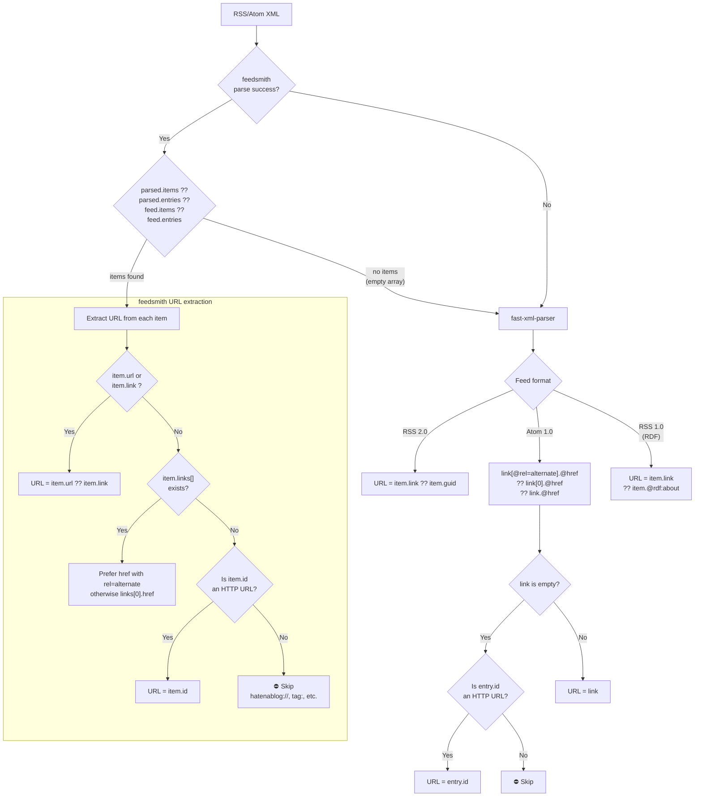
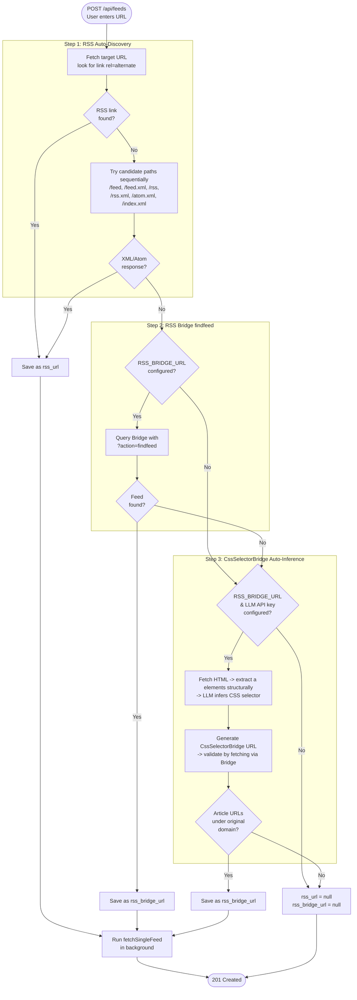
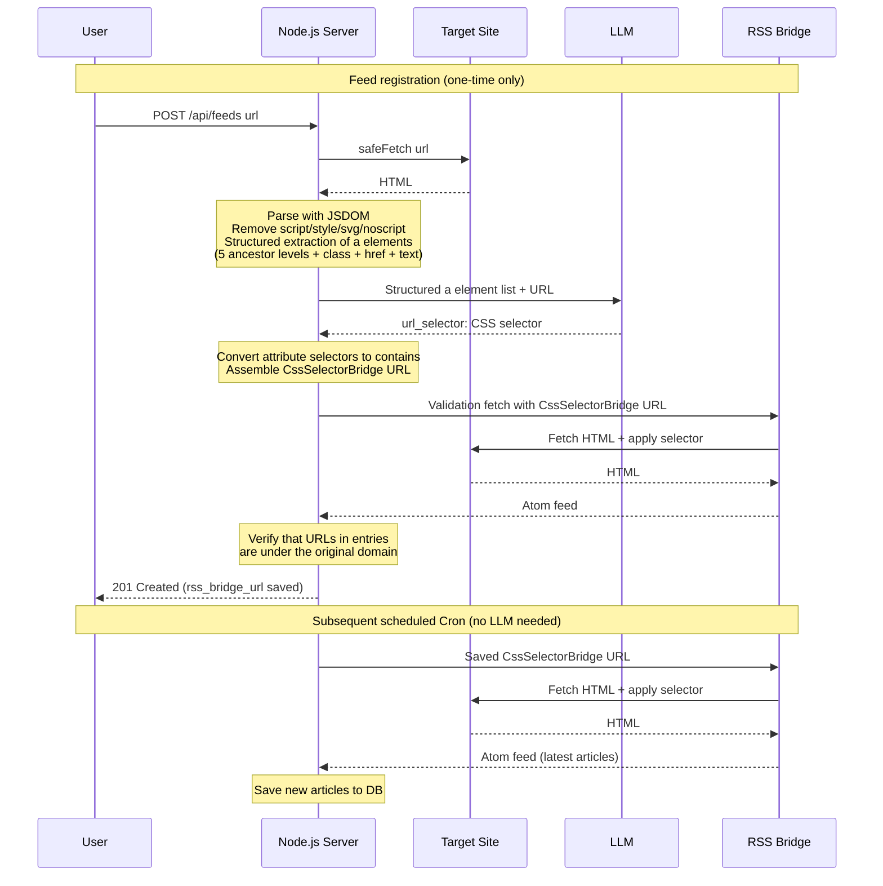

# Oksskolten Spec — Article Ingestion Pipeline

> [Back to Overview](./01_overview.md)

## Article Ingestion Pipeline

### Design Philosophy: Full-Text Retrieval Beyond RSS Feeds

Typical RSS readers (FreshRSS, CommaFeed, etc.) display RSS feed XML content (`content:encoded`, `description`) as-is. Since many feeds provide only a title and a few lines of summary, reading the full text requires navigating to the original site.

Oksskolten **fetches HTML directly from the original URL for every article** and extracts the full text using Readability. This provides:

- **Self-contained reading experience**: No need to navigate to the original site to read articles
- **Higher quality AI processing**: Summaries and translations are based on the complete article body, not RSS fragments
- **Better full-text search accuracy**: Meilisearch indexes the complete article body

> Only Miniflux optionally has a Readability-based Crawler feature, but it requires manual per-feed activation. Oksskolten performs full-text retrieval by default for all articles.

### Cron Processing Flow

Cron runs at 5-minute intervals (`*/5 * * * *`) and processes only feeds whose `next_check_at` has passed.

```
1. SELECT * FROM feeds WHERE disabled = 0 AND type = 'rss'
     AND (next_check_at IS NULL OR next_check_at <= strftime('%Y-%m-%dT%H:%M:%SZ', 'now'))
   <- Feeds with next_check_at = NULL (initial/unset) are fetched immediately
2. Fetch each feed's RSS URL (parallel with semaphore, max 5 concurrent)
   - Prefer rss_url
   - Use rss_bridge_url only if rss_url is NULL
   - Skip if both are NULL (record "No RSS URL" in last_error)
   -- Bandwidth Optimization (2-stage early return) --
   2a. Conditional HTTP request (1st line of defense):
       - Send feeds.etag as If-None-Match, feeds.last_modified as If-Modified-Since headers
       - If the server returns 304 Not Modified, skip the XML download entirely
   2b. Content hash comparison (2nd line of defense, for servers that don't support ETag):
       - Compute SHA-256 of the response body and compare with feeds.last_content_hash
       - If matched, skip XML parsing (early return as notModified)
   2c. On success, update feeds.etag / feeds.last_modified / feeds.last_content_hash
   -- Adaptive Scheduling --
   2e. Determine next check interval from 3 signals:
       - HTTP Cache-Control: max-age / Expires headers
       - RSS <ttl> element (minutes converted to seconds)
       - Empirical (CommaFeed method: step-down based on article update frequency)
         No updates for 30+ days -> 4h / 14-30 days -> 2h / 7-14 days -> 1h / <7 days -> half the average article interval
       - Take the maximum of the 3 signals, clamped to 15min-4hours
       - Save feeds.next_check_at = now + interval, feeds.check_interval = interval
       - On notModified, reuse the previous check_interval (interval is never shortened)
   -- Parsing --
   2d. Parse RSS/Atom with feedsmith -> fast-xml-parser fallback chain
       (Supports RSS 2.0 / Atom 1.0 / RSS 1.0 (RDF))
       See "RSS Parsing and URL Extraction Flow" below for parsing and URL extraction details
   2f. Remove URL tracking parameters (Miniflux method)
       - After parsing and before duplicate checking, strip 60+ tracking parameters from all article URLs
       - Targets: utm_*, mtm_*, fbclid, gclid, msclkid, twclid, mc_cid, _hsenc, etc.
       - Prevents duplicate insertion when the same article is served with different tracking parameters
3. SELECT each article URL -> add those not in articles to the new article list (max 30 per feed)
4. Retrieve existing articles eligible for retry:
   SELECT * FROM articles
   WHERE last_error IS NOT NULL
     AND (full_text IS NULL OR summary IS NULL
          OR (lang != 'ja' AND full_text_ja IS NULL))
5. Process new + retry candidates in parallel with semaphore (max 5 concurrent):
   a. If full_text is NULL -> HTML cleaning + Readability + Turndown for full-text retrieval
      - pre-clean -> Readability -> post-clean -> Markdown conversion (see pipeline details below)
      - Extract OGP image (og_image)
      - Generate 200-character preview (excerpt)
   b. If lang is NULL -> Local language detection via CJK character ratio (no API required)
   c. New articles: INSERT INTO articles / Retry: UPDATE articles
   d. New articles: fire-and-forget async similarity detection (see [83_feature_similarity.md](./83_feature_similarity.md))
   e. On successful processing: clear last_error = NULL
6. Per feed: on fetch success, reset error_count=0, last_error=NULL
7. Per feed: on fetch failure, error_count++, record in last_error
8. Feeds with error_count >= 5 are updated to disabled = 1
9. Remaining work continues in the next Cron cycle
```

### RSS Parsing and URL Extraction Flow

Fallback chain from feedsmith to fast-xml-parser, and the flow for safely extracting URLs from each item. Filters out internal URIs like `hatenablog://` or `tag:` that may appear in Atom `<id>`.



**Note**: Summarization (Haiku) and translation (Sonnet) are not executed during Cron. They are invoked on-demand when the user opens an article (`POST /api/articles/:id/summarize`, `POST /api/articles/:id/translate`).

### Shared Article Fetch Function (`fetchArticleContent`)

The fetch + fallback + language detection logic is encapsulated in a single exported function `fetchArticleContent()` in `server/fetcher.ts`. Both the Cron pipeline (`processArticle`) and the clip save endpoint (`POST /api/articles/from-url`) call this function, ensuring identical behavior for full-text retrieval, FlareSolverr fallback, bot-block detection, and language detection. See [Clip spec](./80_feature_clip.md#shared-fetch-pipeline-with-rss-feeds) for the option differences between RSS and clip invocations.

### Full-Text Retrieval and Markdown Conversion Pipeline

End-to-end flow from article URL to Markdown text. A multi-stage pipeline combining HTML cleaning (defuddle-based) and Readability that removes noise such as ads, navigation, and tracking attributes before converting to Markdown. Runs entirely locally with no external API dependencies.

**Worker Thread Isolation**: DOM parsing (jsdom + Readability + Turndown) is a CPU-intensive synchronous operation that blocks the main thread's event loop. To prevent this, it runs in a Worker Thread pool via piscina (maxThreads: 2). HTTP fetching (async I/O) remains on the main thread, with only DOM parsing delegated to Workers.

```
Main Thread (Event Loop)                Worker Thread (piscina, max 2)
├─ Fastify API <- unaffected            ├─ jsdom DOM construction
├─ cron -> fetchAllFeeds                ├─ Readability article extraction
│   ├─ HTTP fetch (async I/O)          ├─ preClean / postClean
│   └─ pool.run(html) ──────────→      └─ Turndown -> Markdown
└─ health check <- unaffected
```

**Implementation files**: `server/fetcher/content.ts` (HTTP fetching + pool invocation), `server/fetcher/contentWorker.ts` (DOM parsing logic), `server/lib/cleaner/`

```
fetchFullText(articleUrl, cleanerConfig?)
│
├─ 1. HTML retrieval + OGP image extraction [Main Thread]
│     requires_js_challenge=1 -> retrieve via FlareSolverr
│     Otherwise -> safeFetch(url), fallback to FlareSolverr on 403
│
├─ 2-6. Delegate to Worker Thread via pool.run() [Worker Thread]
│
├─ 2. Phase 1: pre-clean (safe removal before Readability)
│     preClean(doc, cleanerConfig)
│     ├─ Remove script, style, noscript, [hidden], [aria-hidden="true"], etc.
│     └─ Delete elements that are definitely noise using ~20 safe CSS selectors
│     * Fail-open: on exception, continue with original HTML
│
├─ 3. Phase 2: Readability body extraction
│     new Readability(doc).parse() -> article.content (HTML)
│     ├─ Automatically excludes sidebars, navigation, footers (same algorithm as Firefox Reader View)
│     └─ Validate Readability result with content block scoring:
│        findBestContentBlock(doc) analyzes paragraph density + link density + class/id indicators
│        Replace if a block has 2x or more text than the Readability result
│
├─ 4. Phase 3: post-clean (noise removal after extraction + normalization)
│     postClean(doc, cleanerConfig)
│     │
│     ├─ Step 1: Selector-based removal
│     │   ├─ Exact match CSS selectors (~100): nav, .sidebar, .ad-container, etc.
│     │   └─ Partial match patterns (~400): substring matching against class/id/data-* attributes
│     │      "social", "share", "comment", "related", etc.
│     │
│     ├─ Step 2: Score-based removal (CJK-aware)
│     │   Identify and remove non-content blocks using character-count-based thresholds
│     │   ├─ Content protection: role="article", class containing "content", etc. -> do not remove
│     │   │   Thresholds: 140 chars + 2 paragraphs, 400 chars standalone, 80 chars + 1 paragraph
│     │   ├─ Navigation indicator text detection: "read more", "subscribe", etc. -> penalize
│     │   ├─ Link density: link text ratio > 50% -> penalize
│     │   └─ class/id patterns: "nav", "sidebar", "footer", etc. -> penalize
│     │   * All use character count (not word count) for CJK language support
│     │
│     └─ Step 3: HTML normalization
│         ├─ standardizeSpaces: \xA0 (nbsp) -> normal space (skip pre/code)
│         ├─ removeHtmlComments: remove all Comment nodes
│         ├─ flattenWrapperElements: unwrap wrapper divs (2 passes)
│         │   ├─ div with single child element -> replace with child
│         │   └─ div with only block children -> unwrap children into parent
│         ├─ stripUnwantedAttributes: remove attributes not on whitelist
│         │   Allowed: href, src, alt, title, width, height, colspan, rowspan, etc.
│         │   SVG elements are protected (attributes not removed)
│         ├─ removeEmptyElements: recursively remove empty elements (preserve br/hr/img, etc.)
│         └─ stripExtraBrElements: limit consecutive <br> to max 2
│     * Fail-open: on exception, continue with Readability output
│
├─ 5. <picture> simplification
│     <picture> -> convert to simple  (avoid srcset issues)
│     Resolve relative URLs to absolute URLs
│
├─ 6. Turndown: HTML -> Markdown conversion
│     headingStyle: 'atx', codeBlockStyle: 'fenced'
│     Table-related tags are kept as HTML
│
└─ 7. Excerpt generation
      Extract first 200 characters from Markdown text
```

**Fail-open design**: pre-clean/post-clean are wrapped in try-catch, and on exception, the original HTML/Readability result is used as-is. This guarantees that cleaner failures never block article ingestion.

**CleanerConfig**: Cleaning behavior can be customized per feed (additional selectors, scoring threshold adjustments, enabling/disabling normalization, etc.).

**Directory structure**:

```
server/lib/cleaner/
  index.ts              <- preClean() / postClean() entry point
  selectors.ts          <- All constants + CleanerConfig + buildPipelineConfig()
  selector-remover.ts   <- removeBySelectors() pure function
  content-scorer.ts     <- CJK-aware scoring + findBestContentBlock()
  html-normalizer.ts    <- HTML structure normalization (6 functions)
```

### Language Detection (Local Processing)

```typescript
function detectLanguage(fullText: string): string {
  const sample = fullText.slice(0, 1000)
  const jaCount = (sample.match(/[\u3040-\u309F\u30A0-\u30FF\u4E00-\u9FFF]/g) || []).length
  return jaCount / sample.length > 0.1 ? 'ja' : 'en'
}
```

If the ratio of CJK characters (hiragana, katakana, kanji) in the first 1000 characters exceeds 10%, the language is `ja`; otherwise `en`. No API calls required, zero cost.

### AI API Calls (On-Demand)

Any of Anthropic / Gemini / OpenAI can be selected from the settings screen. Streaming is supported. Provider and model can be configured independently for summarization and translation (`summary.provider`, `summary.model`, `translate.provider`, `translate.model`).

In addition to LLMs, Google Cloud Translation API v2 and DeepL API v2 are also available as translation providers. Google Translate is faster than LLMs (instant response) and offers a free tier of 500K characters per month ($20/1M characters beyond that). DeepL provides high-quality neural machine translation with particularly high accuracy for Japanese-European language pairs. API Free allows up to 500K characters per month for free; API Pro costs EUR 5.49/month + EUR 25/1M characters.

**Summarization (Default: Anthropic Haiku)**

```typescript
const SUMMARIZE_MODEL = 'claude-haiku-4-5-20251001'
const DEFAULT_PROVIDER = 'anthropic'

// Prompt summary:
// - Line 1: Concisely summarize the overall point of the article in 1-2 sentences
// - Line 3+: List key points as bullet points (3-4 ideal, max 7)
// - Each item in the format "**Key point title** — supplementary explanation"
// - Output in Markdown (bullet points start with "- ")
```

Results are saved in `articles.summary` (Markdown format).

**Translation (Default: Anthropic Sonnet)**

```typescript
const TRANSLATE_MODEL = 'claude-sonnet-4-6'

// Prompt summary:
// - Literal translation without omitting a single word
// - 1:1 with the original text volume
// - Preserve Markdown formatting
```

Results are saved in `articles.full_text_ja`. The entire full_text is passed as-is (not truncated).

**Google Translate (Alternative Provider for Translation Only)**

When `translate.provider` is set to `google-translate`, translation uses Google Cloud Translation API v2 (NMT) instead of an LLM.

- Endpoint: `https://translation.googleapis.com/language/translate/v2`
- API v2 has a 30K character limit per request, so long articles are split into chunks by paragraph (`\n\n`) delimiter and translated sequentially
- Markdown protection: Code blocks, links, images, and URLs are replaced with placeholders before translation and restored afterward
- Monthly character usage is tracked in the `settings` table (`google_translate.usage_month`, `google_translate.usage_chars`)
- No streaming needed (responses are instant), no model selection

**DeepL (Alternative Provider for Translation Only)**

When `translate.provider` is set to `deepl`, translation uses DeepL API v2 instead of an LLM.

- Endpoint: Free plan (`*:fx` key) uses `https://api-free.deepl.com/v2/translate`, Pro uses `https://api.deepl.com/v2/translate`
- Specifies `tag_handling: 'html'` so DeepL handles HTML/Markdown tag protection (no manual masking like Google Translate)
- Max 50K characters per request; chunks by paragraph delimiter when exceeded
- Monthly character usage is tracked in the `settings` table (`deepl.usage_month`, `deepl.usage_chars`)
- No streaming needed (responses are instant), no model selection

Processing flow:
1. User opens an article and selects the "Summary" tab -> invokes summarization via `POST /api/articles/:id/summarize`
2. User selects the "Japanese" tab -> invokes translation via `POST /api/articles/:id/translate`
3. Japanese articles only get summarized, no translation call (minimal cost)
4. Results are cached in the DB; no API calls from the second access onward

### published_at Normalization

```typescript
function normalizeDate(pubDate: string | undefined): string | null {
  if (!pubDate) return null
  const d = new Date(pubDate)
  return isNaN(d.getTime()) ? null : d.toISOString()
}
```

### Parallel Processing

```typescript
// Semaphore: Promise-based concurrency control
class Semaphore {
  private queue: (() => void)[] = []
  private active = 0
  constructor(private max: number) {}
  async run<T>(fn: () => Promise<T>): Promise<T> {
    if (this.active >= this.max) {
      await new Promise<void>(resolve => this.queue.push(resolve))
    }
    this.active++
    try { return await fn() }
    finally {
      this.active--
      this.queue.shift()?.()
    }
  }
}

const CONCURRENCY = 5
```

### Progress Events (EventEmitter)

Feed fetching progress is broadcast via `EventEmitter` and delivered to clients through an SSE endpoint. Supports late connections (current state is retained in the `feedState` map and replayed).

```typescript
type FetchProgressEvent =
  | { type: 'feed-articles-found'; feed_id: number; total: number }
  | { type: 'article-done'; feed_id: number; fetched: number; total: number }
  | { type: 'feed-complete'; feed_id: number }
```

### RSS Auto-Discovery (On Feed Registration)

Resolves the RSS URL through a 3-stage fallback chain.



#### Step 1 Details

1. Fetch the blog URL and look for `<link rel="alternate" type="application/rss+xml">` or `<link rel="alternate" type="application/atom+xml">`. Also retrieve `<title>`
2. If not found, try candidate paths sequentially with HEAD requests: `/feed`, `/feed.xml`, `/rss`, `/rss.xml`, `/atom.xml`, `/index.xml`. If HEAD fails (405, etc.), fall back to GET (5-second timeout)
3. If Content-Type is XML/Atom, save as `rss_url`
4. If an RSS URL is found, fetch the feed itself to retrieve the feed title


### CssSelectorBridge Auto-Inference (Step 3 Details)

For sites where both RSS auto-discovery and RSS Bridge findfeed fail (e.g., claude.com/blog), the LLM infers CSS selectors for article links from the page HTML and automatically generates an RSS Bridge CssSelectorBridge URL.

**Activation conditions**: `RSS_BRIDGE_URL` environment variable is set, and at least one LLM provider API key is configured

**Implementation file**: `server/rss-bridge.ts`

#### Component Roles

| Component | Role | Invocation Timing |
|---|---|---|
| Node.js (`inferCssSelectorBridge`) | Fetch page HTML, structured extraction of `<a>` elements, LLM invocation, Bridge URL generation and validation | Feed registration only (once) |
| LLM | Infer CSS selector for article links from `<a>` element list | Feed registration only (once) |
| RSS Bridge (CssSelectorBridge) | Generate Atom feed from page HTML using the specified CSS selector | Every scheduled Cron run (ongoing) |

#### Processing Flow



#### LLM Prompt Design

The LLM is instructed to:
- Explicitly state that the `<a>` element text will become the RSS feed title
- Select `<a>` elements containing actual article titles, not generic text like "Read more" or category names
- When multiple `<a>` elements point to the same URL, use ancestor classes to distinguish title links
- Use `*=` (contains) for `href` attribute selectors (`^=` is not allowed because CssSelectorBridge converts relative URLs to absolute URLs)

#### Maintenance Characteristics

- **The LLM is called only once at registration time**. Afterward, RSS Bridge directly fetches pages using the saved CssSelectorBridge URL
- **As long as the DOM structure doesn't change**, new articles continue to be automatically fetched
- If a site redesign invalidates the selector, delete and re-register the feed for the LLM to infer a new selector
- JS-only rendered sites are not supported (RSS Bridge's PHP fetcher cannot execute JavaScript)
- LLM cost: Input is a few KB of text, output is a single JSON line. Less than $0.001 per call with Haiku

### Error Handling

| Level | Error | Response |
|---|---|---|
| Feed | Fetch failure | Skip, record in `last_error`, `error_count++` |
| Feed | `error_count` < 3 | Normal retry (retry in next Cron cycle) |
| Feed | `error_count` >= 3 | Exponential backoff: `next_check_at = now + 1h * (error_count - 2)`, max 4 hours. Feed is not disabled |
| Feed | Rate limit (429/503) | Set `next_check_at` per `Retry-After` header (default 1 hour). `error_count` is not incremented |
| Feed | Fetch success | Reset `error_count = 0`, `last_error = NULL`. Update `etag` / `last_modified` / `last_content_hash`. Set `next_check_at` / `check_interval` with adaptive interval |
| Article | Full-text retrieval failure (fetch failure / Readability extraction failure) | `full_text = NULL`, record in `last_error`. Retry in next Cron cycle |
| Article | Claude API failure (summarization / translation) | `summary = NULL` or `full_text_ja = NULL`, record in `last_error`. Retry when user requests again |

SQLite writes use independent INSERTs per article (minimizing the blast radius of failures).

### Search Index Rebuild (Meilisearch)

The Meilisearch full-text search index is rebuilt at the following times:

- **On startup**: Async rebuild on first startup (with backoff retry: 0s -> 5s -> 15s -> 30s)
- **Scheduled Cron**: Rebuild every 6 hours (`0 */6 * * *`)
- During rebuild, the API does not return `503`; instead, `GET /api/health` reports `searchReady: false`. The search endpoint returns `503` when the index is not yet built

### Score Recalculation

After Cron feed fetching completes, `recalculateScores()` recalculates the engagement score for all articles. See [Engagement Score in 10_schema.md](./10_schema.md#engagement-score) for the scoring formula.
